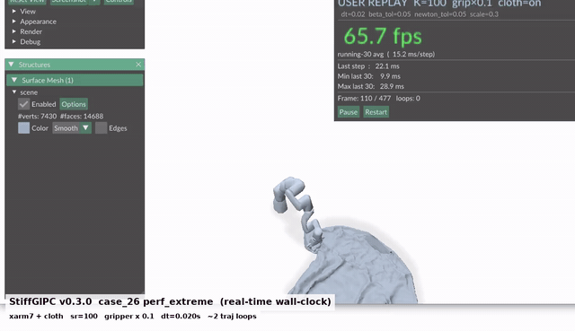

# StiffGIPC — GPU IPC Physics Engine for Python

StiffGIPC is a GPU-accelerated Incremental Potential Contact (IPC) physics engine with Python bindings. It supports rigid-body articulations (URDF), deformable cloth/shell simulation, and coupled rigid-deformable interactions — all running on CUDA.

The `stiff-physics` package provides a self-contained pre-compiled engine. No C++ toolchain or CUDA SDK is required to use it.

## Demo

`examples/case_replay_user_gui.py` plays a 477-frame xarm7 + cloth trajectory at the v0.3.0 `perf_extreme` defaults (`joint_strength_ratio=100`, `gripper-mul=0.1`, `dt=0.020s`). The HUD shows live wall-clock fps, per-step timing, and current frame index. Recorded directly off the rendering window — no slow-mo, no edits:



(Higher-quality MP4: [media/case_26_replay_demo.mp4](media/case_26_replay_demo.mp4))

Run it yourself:

```bash
git clone https://github.com/haoxiangNtu/stiff-physics.git
cd stiff-physics
pip install https://github.com/haoxiangNtu/stiff-physics/releases/download/v0.5.0/stiff_physics-0.5.0-cp311-cp311-linux_x86_64.whl polyscope scipy h5py
PYTHONPATH=. python examples/case_replay_user_gui.py
```

## System Requirements

| Requirement | Details |
|---|---|
| OS | Linux x86_64 (Ubuntu 20.04+) |
| GPU | NVIDIA RTX 4090 (sm_89) or RTX 5090 (sm_120) |
| Driver | NVIDIA driver with CUDA 12.x support |
| Python | 3.11 or 3.12 |

## Installation

### 1. Install the engine (from GitHub Release)

```bash
pip install https://github.com/haoxiangNtu/stiff-physics/releases/download/v0.5.0/stiff_physics-0.5.0-cp311-cp311-linux_x86_64.whl
```

### 2. Install visualization dependencies

```bash
pip install polyscope scipy
```

### 3. (Optional) For USD pipeline examples

```bash
pip install usd-core
```

## Quick Start

```bash
git clone https://github.com/haoxiangNtu/stiff-physics.git
cd stiff-physics
python examples/case_26_arm_cloth_semi_implicit.py
```

This launches an interactive scene with an XArm7 robot arm and a free-falling shirt. Click **Run** to start the simulation, and drag the joint sliders to interact with the cloth in real-time.

## API Overview

```python
from stiff_physics.engine import Engine, Config
from stiff_physics.robot import Robot

# Configure the simulation
config = Config(
    dt=0.01,                              # time step (seconds)
    cloth_young_modulus=1e4,              # cloth stiffness
    semi_implicit_enabled=True,           # fast semi-implicit solver
    assets_dir="/path/to/your/assets/",   # directory containing URDF/mesh files
)

# Create engine and load scene
engine = Engine(config)
engine.native.load_urdf(assets_dir + "robot.urdf", transform, True, False, 1e7)
engine.load_mesh("cloth.obj", dimensions=2, body_type="FEM", transform=tf)
engine.finalize()

# Step the simulation
engine.step()

# Read back vertex positions
vertices = engine.get_vertices()
faces = engine.get_surface_faces()
```

### Key Classes

| Class | Description |
|---|---|
| `Config` | Simulation parameters (time step, material properties, solver settings) |
| `Engine` | Core simulation engine — load meshes/URDFs, step physics, read results |
| `Robot` | Joint-level control for articulated bodies (revolute/prismatic joints) |

### Config Parameters

| Parameter | Default | Description |
|---|---|---|
| `dt` | 0.01 | Time step in seconds |
| `cloth_young_modulus` | 1e5 | Cloth stiffness |
| `cloth_density` | 200 | Cloth mass density |
| `friction_rate` | 0.4 | Coulomb friction coefficient |
| `semi_implicit_enabled` | False | Enable semi-implicit solver for faster convergence |
| `assets_dir` | `""` | Path to assets directory (URDF, meshes) |
| `gravity` | (0, -9.8, 0) | Gravity vector |

## Examples

All examples auto-locate the bundled `assets/` directory. Most require `polyscope` and `scipy` for visualization.

| Script | Description | Extra deps |
|---|---|---|
| **Headless / Scripted** | | |
| `headless_joint_control.py` | No-GUI joint control via code, prints vertex data | scipy |
| **Basic Scenes** | | |
| `case_0_box_pipe.py` | 4x4x4 ABD + FEM cubes free-fall | |
| `case_1_soft_rigid_cloth.py` | Bunny + cloth interaction | |
| `case_3_fixed_cloth.py` | Cloth pinned at two corners | |
| `case_5_box_pipe_large_cloth.py` | Cubes + large cloth | |
| **URDF Robot Loading** | | |
| `case_6_urdf_test.py` | Minimal URDF loading test | |
| `case_7_xarm_test.py` | XArm7+gripper gravity test | |
| `case_8_xarm7_gripper_test.py` | XArm7+gripper with joint control | |
| `case_13_xarm7_gripper_no_collision.py` | XArm7 with self-collision disabled | |
| `xarm_move_demo.py` | XArm6 direct URDF joint control | |
| `xarm_move_demo_usd.py` | XArm7 via URDF-to-USD pipeline | usd-core |
| **Robot + Soft Body** | | |
| `case_15_xarm_gripper_soft_cube.py` | XArm7 gripper + soft cube + cloth | |
| `case_16_xarm_gripper_cup.py` | XArm7 gripper + cup | |
| `case_17_table_cloth.py` | Table + large cloth draping | |
| `case_18_arm_table_cloth.py` | XArm7 + table + cloth | |
| `case_19_arm_hanging_cloth.py` | XArm7 + hanging cloth | |
| **Franka Panda** | | |
| `case_21_franka_table_cloth.py` | Franka + table + shirt + trajectory | |
| `case_22_xarm_table_cloth.py` | XArm7 + table + cloth + trajectory | |
| `case_23_franka_coarse.py` | Franka (coarse mesh) + shirt + trajectory | |
| **Cloth-Only** | | |
| `case_24_shirt_freefall.py` | Shirt free-fall (full implicit) | |
| `case_25_shirt_freefall_semi_implicit.py` | Shirt free-fall (semi-implicit) | |
| **Interactive Demo** | | |
| `case_26_arm_cloth_semi_implicit.py` | XArm7 + shirt with live joint sliders | scipy |
| `case_26_render_obj_indices.py` | XArm7 + shirt with per-body coloured rendering | scipy |
| `case_26_perf_tuned.py` | Same as `case_26` with tuned solver tolerances (~1.26× faster) | scipy |

### Headless / Scripted Control

`headless_joint_control.py` shows how to drive joints from pure Python without any GUI:

```python
from stiff_physics.engine import Engine, Config
from stiff_physics.robot import Robot

engine = Engine(Config(assets_dir=ASSETS_DIR, semi_implicit_enabled=True))
# ... load URDF and mesh ...
engine.finalize()
robot = Robot(engine)

for frame in range(100):
    robot.set_revolute_position(0, frame * 0.6, degree=True)  # sweep joint1
    robot.set_joint_position("joint3", 30.0, degree=True)     # by name
    engine.step()
    verts = engine.get_vertices()  # read back vertex positions
```

## Performance Tuning

The default `Config` is tuned for **accuracy first** — it is conservative on
solver tolerances so simulation results stay close to a fully-converged
reference solution. If your scene tolerates a small amount of accuracy
slack (e.g. visual demos, prototyping, simple cloth + light contact), you
can trade a bit of accuracy for noticeable speedup.

### Tunable Config knobs (tested on `case_26`)

All measurements below: RTX 4090, n=30 trials per cell (3 independent batches × 10 trials each, with 3-round GPU warmup per batch, randomized cell order, paired t-test).

**Effective tuning knobs** (stacked in `case_26_perf_tuned.py`):

| Knob | Default | Tuned | Marginal speedup | Stacked speedup vs default | p-value |
|---|---|---|---|---|---|
| `semi_implicit_beta_tol` | `1e-3` | **`5e-2`** | **+10.6%** | 1.11× | 3×10⁻¹⁹ |
| `newton_tol` (on top) | `1e-2` | **`5e-2`** | +7.5% | 1.19× | 5×10⁻²⁵ |
| `dt` timestep (on top) | `0.010` | **`0.020`** | +20.5% | **1.43×** | 6×10⁻³¹ |

**Knobs tested but NOT worth changing** (rigorous measurement, no measurable speedup):

| Knob | Tried | Effect on case_26 | Why skipped |
|---|---|---|---|
| `relative_dhat` | `5e-4` (tighter) | ~0% (noise-level) | Halves collision-pair count but doesn't reduce total wall time on this binary |
| `pcg_tol` | any looser value | inconclusive | Loosening hurts PCG search direction; net win unclear, real stability risk |
| `joint_strength_ratio` | `50` … `5000` sweep | all within ±1% (noise) | Joint solve is not the bottleneck — all variants identical at `p > 0.5` |
| **finger-only collision exclusion** (shirt vs `left_finger` + `right_finger` only, exclude other 13 arm bodies) | explicit `engine.add_collision_exclusion(non_finger_bid, shirt_bid)` | **+0.48% (basic), −0.08% (perf_tuned), `p ≥ 0.5`** | Cloth self-contact dominates the collision-pair count; arm-shirt pairs are <5% of total cp, so excluding them has no measurable effect |
| `collision_detection_buff_scale`, `linear_system_buff_scale`, `semi_implicit_min_iter` | various | individually borderline, combined −4% | Negative interaction when stacked; not worth the complexity |
| H2 PCG warm start / H3+H4 cudaMalloc-event / H5 CUB + FEM reduce (engine-level) | cherry-pick from experimental branches | all p>0.8, indistinguishable from zero | See maintainer notes; PERF_OPT_HANDOVER's 2.17× numbers were on a different baseline (pre-stability-fix), not reproducible on the shipped binary |

### Measured speedup on `case_26` (RTX 4090, 1.0 simulated second, n=30)

| Configuration | Wall time | 95% CI | Speedup | Cloth drift (vs default) |
|---|---|---|---|---|
| All defaults (`case_26_arm_cloth_semi_implicit.py`) | 4.14 s | [4.10, 4.19] | 1.00× | — |
| `beta_tol=5e-2` only | 3.75 s | [3.70, 3.79] | **1.11×** | ~3 mm |
| `beta_tol=5e-2` + `newton_tol=5e-2` | 3.49 s | [3.45, 3.52] | **1.19×** | ~3 mm |
| Full `case_26_perf_tuned.py` (+ `dt=0.020`) | **2.89 s** | **[2.87, 2.91]** | **1.43×** | ~8 mm |

Cloth-shape drift of 3–8 mm on a ~30 cm cloth is below visual perception;
Y-fall trajectory is consistent within 1 mm across all four configurations.

### dt sweep observations

`dt` has a U-shape — neither "smaller is always more accurate" nor "bigger
is always faster":

| `dt` | Wall / sim-sec | vs default |
|---|---|---|
| `0.005` | 5.14 s | 0.68× (slower — step count doubles) |
| `0.0075` | 4.02 s | 0.87× (slower) |
| `0.010` | 3.46 s | 1.00× (default) |
| `0.015` | 3.00 s | 1.16× |
| **`0.020`** | **2.89 s** | **1.21× (peak)** |
| `0.025` | 3.02 s | 1.15× (Newton iters start exploding) |
| `0.030` | 2.96 s | 1.17× (no further benefit, drift grows) |

### Advanced: collision exclusion for scene-specific constraints

If your scene design requires excluding specific body pairs from collision
checking (e.g. you know certain bodies should pass through each other), you
can use `engine.add_collision_exclusion(body_a, body_b)`. Note this does
NOT give a speedup on `case_26`-like scenes where cloth self-contact
dominates the collision-pair budget — but it can matter for scene logic:

```python
# Example: exclude all arm links except fingers from colliding with shirt
finger_ids = {13, 14}   # left_finger, right_finger (XArm7+gripper body order)
shirt_bid = engine.abd_body_count   # FEM shirt body, right after ABD bodies
for bid in range(engine.abd_body_count):
    if bid not in finger_ids:
        engine.add_collision_exclusion(bid, shirt_bid)
```

### When to use which script

| Use case | Recommended script |
|---|---|
| Visual demo / interactive prototyping | `case_26_perf_tuned.py` |
| Need solver speedup but keep default `dt` (e.g. external sim pacing) | Copy `case_26_perf_tuned.py` and change `dt=0.020` back to `dt=0.010` |
| Force-accurate contact study | `case_26_arm_cloth_semi_implicit.py` (default) |
| Convergence ablation / research baseline | `case_26_arm_cloth_semi_implicit.py` (default) |

The tuning above is **measured on `case_26` specifically** (XArm7 + single
falling shirt, mostly self-contact). Re-measure on your own scene before
assuming the same speedup or accuracy holds — complex multi-body contact,
fast-moving rigid scenes, or stiffer cloth may behave differently.

## Project Structure

```
stiff-physics/
  README.md
  examples/                                 # 22 example scripts
  assets/
    sim_data/urdf/xarm/                     # XArm6/7 robot URDFs + meshes
    sim_data/urdf/franka_panda/             # Franka Panda URDF + meshes
    sim_data/urdf/test_robot/               # Minimal test URDF
    tetMesh/                                # Volumetric meshes (cube, bunny)
    triMesh/                                # Surface meshes (cloth, shirt)
    trajectories/                           # Pre-recorded joint trajectories
```

## Troubleshooting

**`ImportError: libstiffgipc_core.so: cannot open shared object file`**
The wheel bundles the core library. If you see this, make sure you installed the wheel (not just cloned the repo).

**`CUDA error: no kernel image is available for execution on the device`**
Your GPU architecture is not included in this build. The pre-built wheel supports sm_89 (RTX 4090) and sm_120 (RTX 5090) only.

**`ImportError: liburdfdom_model.so: cannot open shared object file`**
Install the urdfdom system library: `sudo apt install liburdfdom-dev`

## License

This project is provided as pre-compiled binaries. Contact the authors for licensing information.
