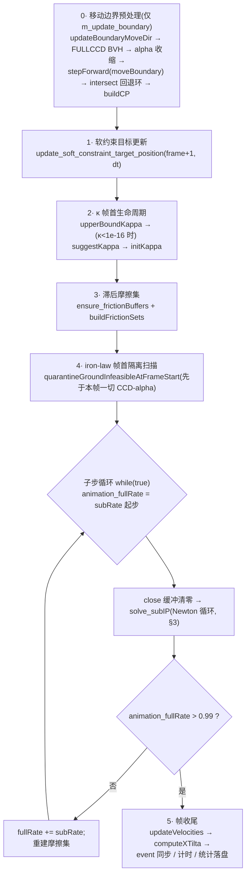

# StiffGIPC 手册 · 原理篇:动力学与能量

> **本篇地位**:StiffGIPC 手册的动力学分册,讲清"每一帧求解器在最小化什么、怎么迭代、什么时候停"。
> 接触/摩擦对的生成与 CCD 细节见 [接触与 CCD 分册](PRINCIPLES_CONTACT.md);PCG/MAS 线性求解见 [PRINCIPLES_EXECUTION.md](PRINCIPLES_EXECUTION.md) §2;多环境(multi-env)机制见 [API_EXECUTION.md](API_EXECUTION.md) §1 与 [PRINCIPLES_EXECUTION.md](PRINCIPLES_EXECUTION.md) §3;整帧 CUDA Graph 与 GPU 驻留 RL 见 [PRINCIPLES_EXECUTION.md](PRINCIPLES_EXECUTION.md) §5–6、[API_EXECUTION.md](API_EXECUTION.md) §3–4 与 `工程仓 docs/SIMULATOR_EXECUTION_DESIGN.md`。

**版本与行号约定**

| 线 | 仓库 | 分支 / HEAD | 说明 |
|---|---|---|---|
| **稳定线** | `Stiff-GIPC-stable-08` | `release/stable-0.8`,发布 tag **v0.8.5.3**(commit `b8e27a1`,2026-08-11;公开仓 `github.com/haoxiangNtu/stiff-physics` 挂 cp311/cp312 wheel,CUDA sm_80/89/120) | 重构前单体布局:求解器在 `StiffGIPC/GIPC.cu`(约 1.69 万行),引擎壳在 `StiffGIPC/sim_engine.cu` |
| **工程线(phase-cd)** | `Stiff-GIPC-c1-ls-graph` | `codex/phase-cd`,HEAD `b3ab747` | v0.8.6 模块化重构(`core/`、`energy/`、`gipc_modules/`、`engine_modules/` 等)+ 整帧 CUDA Graph、GPU 驻留 RL、episode、checkpoint v2 等 v0.8.5 之后的全部工作 |

- 未标注仓库的 `文件:行号` 一律指 **phase-cd 树**(`StiffGIPC/` 前缀省略);稳定线出处写作 `(稳定线 GIPC.cu:NNNN)`。
- ⚠ 磁盘上的稳定线工作树 HEAD 是 `c0339c8`——即 tag **v0.8.5.4** 所指的提交本身(带 "release(v0.8.5.4)" 消息的 `0894958` 是其父提交);该线携带静摩擦锚 friction_anchor / absolute_epsv 工作,**不属于本手册记述的 v0.8.5.3 发布**。本篇引用的稳定线行号按 **tag `v0.8.5.3`(`b8e27a1`)的 blob**(勘探时工作树曾被误留的暂存回退按在该内容上、与 blob 逐字节相同,故无偏移);工作树已于 2026-09-08 恢复为 v0.8.5.4 内容,复核请用 `git show v0.8.5.3:<文件>`,不要按磁盘行号。v0.8.5.4 独有行为在文中单独标注。
- 适用线标签:**【稳定线+phase-cd】**两线均有;**【仅 phase-cd】**;**【仅稳定线】**;**【实验性,默认关】**需要环境变量显式开启。

**本篇目录**

1. [变分框架总览](#1-变分框架总览)
2. [时间步进主循环(IPC_Solver)](#2-时间步进主循环ipc_solver)
3. [Newton 迭代与退出判据](#3-newton-迭代与退出判据)
4. [线搜索(lineSearch)](#4-线搜索linesearch)
5. [能量项逐项详解(15 槽)](#5-能量项逐项详解15-槽)
6. [ABD 仿射体系统](#6-abd-仿射体系统)
7. [关节与驱动](#7-关节与驱动)
8. [刚柔耦合:stitch 弹簧与 FEM-pin](#8-刚柔耦合stitch-弹簧与-fem-pin)
- [附录 A:本篇参数默认值总表](#附录-a本篇参数默认值总表)
- [附录 B:本篇相关环境变量](#附录-b本篇相关环境变量)
- [附录 C:已知不一致与刻意退役的死路径](#附录-c已知不一致与刻意退役的死路径)

---

## 1. 变分框架总览

### 1.1 增量势能极小化(Incremental Potential Minimization)

StiffGIPC 是 IPC(Incremental Potential Contact)家族求解器:每帧(每子步)把 implicit Euler 时间积分写成一个无约束极小化问题,对**全部自由度一次性求解**(单体求解,无算子分裂):

```
x^{t+1} = argmin_x  E(x)
E(x) = E_kinetic(x) + dt²·E_elastic(x) + E_contact(x; κ) + E_friction(x; μ, λ_lag) + E_constraint(x)
```

自由度由两部分拼接:

- **FEM 顶点** `x ∈ R^{3N}`(四面体软体 + 三角壳布料),惯性预测位置
  `x̃ = x^t + dt·v^t + dt²·g`(仅 `BoundaryType==0` 且 `apply_gravity` 的顶点加重力项;kernel `_computeXTilta`,gipc_modules/08_step_update_topology.inl:191-214)。
- **ABD 仿射体广义坐标** `q ∈ R^{12}`/体(平移 + 3×3 仿射矩阵按行展开,见 [§6.1](#61-状态表示q-的-12-维布局)),预测位置
  `q̃ = q_prev + q̇·dt + (g_gen + M⁻¹F_ext)·dt²`(abd_system/abd_system_function/cal_q_tilde.cu:184-217)。

两套 DOF 经接触 barrier、stitch 弹簧、FEM-pin 组装进**同一个** Newton 线性系统(ABD 每体 4 个 3×3 块行 + FEM 每点 1 块;`ABDLinearSubsystem::retrieve_solution` 从全局解向量切出 `dq`,linear_system/subsystem/abd_linear_subsystem.cu:35-57)。

每次 Newton 迭代:装配 `∇E` 与 `∇²E`(逐项 PSD 投影)→ PCG 解 `H·d = ∇E` → CCD 求可行步长上限 → 线搜索回溯 → `x ← x_temp − α·d`(**`_moveDir` 按梯度方向约定存放,步进做减法**;`_stepForward`,gipc_modules/08_step_update_topology.inl:16-28;ABD 同款约定注释 "GIPC use gradient, not the negative gradient",abd_system_function/cal_x_from_q.cu:64)。

### 1.2 总能量组合公式【稳定线+phase-cd】

单线程组合核 `_global_energy_combine`(energy/01_energy_host_dispatch.inl:274-307;稳定线同名核定义于 GIPC.cu:14283,发射于 :14330)以固定运算次序(`__dadd_rn`/`__dmul_rn`,防 `--use_fast_math` 重结合)把 15 个能量槽合成标量:

```
E = slots[0]                                  ← FEM 动能
  + slots[9..14]                              ← ABD 六项(动能/shape/joint/rev_drive/prismatic/pri_drive)
  + dt²·slots[1] + dt²·slots[2] + dt²·slots[3] ← FEM 弹性 / 膜 / 弯曲
  + slots[4]                                  ← 软约束(soft/stitch)
  + slots[5]                                  ← 自碰 barrier(κ 已在核内乘入)
  + Kappa·slots[6]                            ← 地面 barrier(核内不乘 κ,此处乘)
  + frictionRate·slots[7]                     ← 自碰摩擦(仅 USE_FRICTION,恒开)
  + gd_frictionRate·slots[8]                  ← 地面摩擦
```

**量纲规则**:`dt²` 只作用于三个弹性势(slot 1/2/3);接触/摩擦/软约束/ABD 项不乘 `dt²`(κ、λ、motionRate、关节 strength 各自吸收量纲;关节能量"NO dt² factor"是刻意设计,见 [§7](#7-关节与驱动))。ABD shape 项在核内已含 `dt²`(cal_abd_energy.cu:205),组合时裸加。

### 1.3 E_total 能量清单一览表

槽位 → 内容 → 数学形式 → 组合因子 → 参数来源 → 详见:

| slot | 内容(注册 type) | 数学形式(概要) | 组合因子 | 刚度/参数来源 | 详见 |
|---|---|---|---|---|---|
| 0 | FEM 动能(type 0) | `Σ ½ mᵢ‖xᵢ−x̃ᵢ‖²` | 1 | 质量装配(密度×体积/面积) | §5.1 |
| 1 | FEM 四面体弹性(type 1) | Stable Neo-Hookean(默认 SNK1) | dt² | per-tet `lengthRate/volumeRate`(修正 Lamé) | §5.2 |
| 2 | 布料膜(type 8) | Baraff-Witkin 变体(拉伸+剪切,拉伸侧立方强化) | dt² | `stretchStiff/shearStiff/strainRate` | §5.3 |
| 3 | 弯曲(type 10) | quadratic bending(默认)或二面角 | dt² | `bendStiff` | §5.4 |
| 4 | 软约束 soft/stitch(type 9) | `½·motionRate·rate²·‖x−target‖²` | 1 | `soft_motion_rate`,rate=`animation_fullRate` | §5.5 |
| 5 | 自碰 barrier(type 2) | `κ·(d−d̂)²·ln²(d/d̂)`(平方距离;mollified EE 另有系数) | 1(κ 内含) | κ 生命周期(§2.3),`dHat` | §5.6 |
| 6 | 地面 barrier(type 4) | `−(d²−d̂)²·ln(d²/d̂)` | ×Kappa | 同上 | §5.7 |
| 7 | 自碰摩擦 lagged(type 5) | `λ·f0(‖u‖)`(半隐式滞后) | ×frictionRate | `friction_rate`、per-body μ、`fDhat` | §5.8 |
| 8 | 地面摩擦 lagged(type 6) | `λ·f0_gd(‖v_t‖)` | ×gd_frictionRate | `gd_friction_rate` | §5.9 |
| 9 | ABD 动能 | `½ dqᵀM dq`(+Animated/Motor 罚) | 1 | ABD 12×12 质量 | §5.10 / §6 |
| 10 | ABD shape(正交性) | `κ_abd·V_b·dt²·S(q)` | 1(dt² 内含) | `ABDSystemParms::kappa = 1e8` | §5.10 / §6.5 |
| 11 | ABD joint | `½K Σ w_k‖J_p q_p − J_c q_c‖² + 方向项` | 1 | `joint_strength_ratio·(m_p+m_c)` | §7.1 |
| 12 | ABD revolute drive(+限位) | `½K(sin²δ + 0.02(1−cosδ)²)` + 限位弹簧 | 1 | `revolute_driving_strength_ratio` 等 | §7.2 |
| 13 | ABD prismatic 约束 | 叉积+方向匹配四项 | 1 | `prismatic_strength_ratio·(m_p+m_c)` | §7.3 |
| 14 | ABD prismatic drive(+限位 barrier) | `½K(d−d_tgt)²` + log-barrier | 1 | `prismatic_driving_strength_ratio` | §7.3 |

**注册了但当前无效的两项**(两线一致,附录 C):

- **type 3(delta)**:线搜索方向导数项 `Σ bᵢ·dxᵢ`(energy/18_delta.inl:7-18)。唯一调用点是 Armijo 项 `c1m += armijoParam * Energy_Add_Reduction_Algorithm(3, ...)`,而 `armijoParam` 是**局部常量 0**(core/ipc_solver.inl:247-252)→ 死代码,线搜索实为纯能量回溯(§4.3)。
- **type 7(rest_nhk)**:SNK2 本构的静止态能量偏置常数 `Σ(½λ'(3μ'/4λ')² − ½μ'ln4)·V`(energy/11_fem_elastic.inl:43-62)。两棵树均无调用点。

**⚠ 调试标签错位(仅 phase-cd)**:`STIFF_ENERGY_VALIDATE=1` 时打印的 `kSlotNames` 表(energy/01_energy_host_dispatch.inl:365-369)把 slot 5 标成 "ground"、slot 6 标成 "barrier(xKappa)"——**与实际写入相反**(写入代码 :317-318:type 2 自碰 barrier → slot 5,type 4 ground → slot 6;组合数学正确,仅打印文本互换)。**同一套互换标签还独立复制在 §4.6 lsx-diag 的逐槽打印表 `kN[15]` 里**(core/ipc_solver.inl:750-754)——读这两种诊断输出时都按本表纠正。稳定线无此打印。

### 1.4 能量层实现骨架【稳定线+phase-cd】

- `double GIPC::computeEnergy(device_TetraData&)` — 15 槽 device 归约 + 组合 + 一次 D2H,返回全局总能量(energy/01_energy_host_dispatch.inl:387-399)。
- `void GIPC::computeEnergy_DeviceOut(device_TetraData&, double* out)` — 结果留在 device 标量,线搜索/整帧图全程零 D2H 走这条(:309-385)。
- `Energy_Add_Reduction_Algorithm_DeviceOut(int type, ..., double* out_slot, double* out_penv=nullptr, double energy_kappa=-1.0)` — 单项归约;`out_penv` 非空时按 `d_point_to_group` 做 per-env 原子桶(容量 256);`energy_kappa` 仅 barrier 消费(传 1.0 得"单位 κ 裸能量",-1.0 用成员 `Kappa`)(:205-268)。⚠ 传 `energy_kappa=0.0` 会得到零 barrier 能量,无断言防护。
- 归约树:块内 warp-shuffle 固定结合序(`gipc_block_sum_to`,device_common/reductions.cuh:26-66)+ `__add_reduction` 折半——逐位可复现的前提。
- per-env 能量:`computeEnergy_perenv[_dev]` 按与全局**完全相同的次序与因子**逐 env 合成,已验证 `Σ_g E_g == E_global`(机器精度)(:506-576);ABD 侧用 binned deposit(Demmel–Nguyen 式)而非 atomicAdd——atomicAdd 调度序的 ~1e-16 抖动曾翻转 line search 折半决策造成跨 batch 姿态漂移(cal_abd_energy.cu:299-304 注释)。
- **【仅 phase-cd】** X-macro 项表 `GIPC_ENERGY_TERMS`(energy/energy_terms.h:41-52)、energy/ 目录 TU 拆分、`m_energy_bound_cp/gp` 设备计数钩子、`kappa_dev` 尾参(整帧图用)。稳定线为单体 GIPC.cu 内手写 if-else 尺寸链(其中还残留已删除的 type 11 痕迹,稳定线 GIPC.cu:14165)。
- 编译期物理开关(两线):`ADAPTIVE_KAPPA; USE_FRICTION; USE_QUADRATIC_BENDING` 恒开;FEM 本构 phase-cd 经 CMake `STIFFGIPC_FEM_MODEL`(默认 "SNK1",可选 SNK2/ARAP;CMakeLists.txt:57-64,92-109),**稳定线硬编码 USE_SNK1**(稳定线 CMakeLists.txt:43-49)。全程 `--use_fast_math`,故所有序敏感组合处用 `_rn` 圆整内建锁定次序。

---

## 2. 时间步进主循环(IPC_Solver)

### 2.1 入口与分派

- `Engine::step()` → `GIPC::IPC_Solver(device_TetraData&)`(engine_modules/03_step_getters_export.inl:72-89)。**【仅 phase-cd】** 环境变量 `STIFF_FRAME_GRAPH` 非零时改走 `IPC_Solver_FrameGraph`(整帧条件图);gpu_rl 驻留(episode graph)在更早处分派,episode 图 in-flight 时 `step()` 抛 `LifecycleError`(:57-63)。稳定线只有宿主 `IPC_Solver`。
- `IPC_Solver` 无返回值,同步语义:帧末 `cudaEventSynchronize`,"Engine.step remains synchronous, but only waits for this PTDS chain"(core/ipc_solver.inl:2627-2629;稳定线 GIPC.cu:16667 起同构)。
- 帧内阶段顺序的**唯一权威文档**是 `core/frame_pipeline.h`(doc-only 头文件,要求与 `core/ipc_solver.inl` 同 commit 更新)。

### 2.2 一帧的行走【稳定线+phase-cd】

`GIPC::IPC_Solver`(core/ipc_solver.inl:2490-2713;稳定线 GIPC.cu:16667ff):



逐条要点(行号均 core/ipc_solver.inl):

1. **移动边界预处理**(2503-2555):`buildBVH_FULLCCD(alpha)` + `buildFullCP(alpha)`;有 CCD 候选时用 `self_largestFeasibleStepSize` 收缩 alpha;`stepForward(..., moveBoundary=true)` 后 intersect 回退环(预算 = `line_search_max_iter>0 ? line_search_max_iter : 64`,每次 `alpha /= 2`),超预算抛 `std::runtime_error("[StiffGIPC] boundary-move intersection persists after backtracking ...")`。
2. **软约束目标更新**(2557):把动画/驱动目标推进到本帧。
3. **κ 帧首生命周期**(2559-2564):见 §2.3。
4. **摩擦集**(2566-2569,`USE_FRICTION` 恒开):`ensure_frictionBuffers()`(grow-only,无每帧 malloc)+ `buildFrictionSets()`。摩擦的法向力 λ 与切向基 T 在**帧边界/子步边界**冻结,Newton 迭代内不变(标准 IPC 滞后摩擦,§5.8)。
5. **子步驱动循环**(2570-2618):一帧切成 `ceil(1/animation_subRate)` 个 sub-IP。**这是驱动 ramp,不是时间细分**——`IPC_dt` 不变,只有软约束/stitch 目标按 `animation_fullRate`(0→1)内插,软约束有效刚度 ∝ rate²;每子步一整个 Newton solve + 摩擦集重建。引擎路径 `animation_subRate` 恒被设为 1.0(GIPC 构造 gipc_modules/09_friction_sets_host_mem.inl:725、engine 上载 engine_modules/01_config_upload.inl:995)⇒ **默认单子步**;gl_main 演示程序才设 `1/motion_rate`(gl_main.cu:4375)。
6. **帧收尾**(2624-2635):`updateVelocities`(FEM:`v = (x−o_x)/dt`,非自由顶点 v=0,同时提交 `o_x ← x`,gipc_modules/08:74-97;ABD:`q̇ = (q−q_prev)/dt`,Fixed→0,`q_prev ← q`,§6.4)→ `computeXTilta(TetMesh, 1)`(为下一帧算 x̃/q̃)→ 计时统计。
7. 每帧落盘 `timeCost.txt`(time0=GH 装配、time1=PCG、time2=CCD-BVH、time3=line-search、time4=κ 更新)与 `stats.json`(2679-2709)。
8. 子步循环里取的 `minMaxGroundDist()/minMaxSelfDist()` 读数(2590-2594)在本函数内**无后续消费**(遗留读数)。

### 2.3 κ(接触刚度)生命周期【稳定线+phase-cd】

κ 是 IPC barrier 的自适应刚度。成员 `Kappa` 初值 0.0(GIPC.cuh:580),`minKappaCoef = 1e11`(gipc_modules/09:609)。**每帧**执行三件套(core/ipc_solver.inl:2559-2564):

```
upperBoundKappa(Kappa)              // 钳到上限
if (Kappa < 1e-16) suggestKappa(Kappa)  // 首帧/未初始化时给建议值
initKappa(TetMesh)                  // 梯度投影重估
```

公式(gipc_modules/13_kappa_partition_gradhess.inl:1-255;`H_b` 为平方距离 barrier 的二阶导 `compute_H_b(d,d̂) = −2·ln(d/d̂) − 4t/d + t²/d²`,`t=d−d̂`,gipc_modules/12_host_wrappers_fem.inl:1178-1182):

| 函数 | 公式 | 行号 |
|---|---|---|
| `suggestKappa` | `κ_sug = minKappaCoef · meanMass / (4e-16 · bb · H_b(1e-16·bb, dHat))`(meanMass==0 时去掉该因子) | 13:1-30 |
| `upperBoundKappa` | `κ_max = 100 × κ_sug`;`κ > κ_max` 则钳到 κ_max | 13:32-51 |
| `initKappa` | 有接触时:非接触梯度 `_GE`(动能+弹性+软约束)与**单位刚度**接触梯度 `_gc` 做投影 `minKappa = −⟨gc,GE⟩/⟨gc,gc⟩`(FEM DOF + ABD 12-DOF 广义梯度域);`Kappa = max(minKappa, κ_sug)` 再 `upperBoundKappa` 钳制 | 13:54-255 |

- `bb` 的选择(abs-kappa 一致性):默认 `bb = bboxDiagSize2`(全场景包围盒对角²);当 `absolute_dhat>0 && relative_dhat>0` 时改用 `bb = (absolute_dhat/relative_dhat)²`——κ 尺度跟随物理接触尺度而不是随 env 数/间距被稀释(多环境消融 C2:258 vs 489 Newton 全因此;诊断逃生旗 `STIFF_DIAG_KAPPA_MERGEDBB`)(13:7-16)。
- 多环境:`pergroup_kappa` 时 initKappa 内提早启用 per-group κ 并播种;`decouple_thresh` 时进一步逐 env 做 gsum/gsnorm 归并出 per-env κ(floor=batch 不变的建议值、cap=κ_max)(13:56-81, 171-238)。
- **帧内 κ 翻倍是刻意退役的死路径(两线一致)**:`postLineSearch` 里的 `checkCloseGroundVal()/checkSelfCloseVal()` 分别 gate 于 `h_close_gpNum/h_close_cpNum`,而这两个 host 计数**全树只有声明+初始化 0,无任何写点**(GIPC.cuh:577-578;稳定线 GIPC.cuh:233-234 同)→ 两个 check 恒 false → `Kappa *= 2.0` 永不触发。上游注释:"The legacy close-contact Kappa-doubling strategy is intentionally disabled: its raw restore destabilizes coupled ABD contact. Kappa is initialized by the gradient-projection strategy each frame instead."(gipc_modules/09:918-920)以及 "do not revive ... without a separately validated adaptive-contact redesign"(gipc_modules/12:344-345)。**结论:κ 是逐帧重初始化量,不做帧内自适应**。close 集重建本身仍活着(设备计数被图路径与 buildCP 消费),只是 host 镜像从不回读。
- **【仅 phase-cd,诊断】** 整帧图路径曾因读设备计数而忠实"复活"了这条死路径,导致 foldshirt 抓合帧 κ 六连翻(41.73→2670.70)、线搜索 127 trial 把 α 压到 2.4e-31 杀帧;现默认与宿主对齐(不翻倍),旧行为留在 `STIFF_GRAPH_LEGACY_KAPPA_DOUBLE` 旗后(gipc_modules/10_ccd_buildcp_quarantine.inl:3151-3172)。

### 2.4 postLineSearch【稳定线+phase-cd】

`GIPC::postLineSearch(device_TetraData&, double alpha)`(core/ipc_solver.inl:1149-1222;alpha 形参实际未使用)在每个 Newton 迭代线搜索之后调用(收敛 break 掉出的迭代不执行):

- `Kappa == 0.0` → `initKappa`(1151-1154)。
- per-group κ 分支 / 全局标量分支:跑 close-val 检查(恒 false,见上)→ 重建 close 集(`computeCloseGroundVal/computeSelfCloseVal` 以 `dTol` 填设备计数与 ID/Val 数组)。
- `STIFF_POSTLS_FREEZE`【仅 phase-cd,诊断】:跳过帧内 kappa/close-set 簿记,用于图路径因果测试(1155-1162)。

---

## 3. Newton 迭代与退出判据

`int GIPC::solve_subIP(device_TetraData&, double& time0..time4)`(core/ipc_solver.inl:1232-2487;稳定线 GIPC.cu:15415ff 逐段同构)返回本子步消耗的 Newton 迭代数。

### 3.1 每迭代顺序

`for(k = 0; k < iterCap; ++k)`(1253, 1356):

1. `computeGradientAndHessian`(1425)——梯度与 Hessian 装配(帧首 triplet 增长只允许 `ensure_capacity_discard`,其他位置必须 `ensure_capacity_preserve`,towel-strict 根因;core/frame_pipeline.h)。
2. `calculateMovingDirection`(1629)——MAS/diag 预条件 + PCG(见线性求解器分册)。
3. 隔离环境方向消毒(1649-1679)【多环境】:PCG 出方向后立刻按 env 扫非有限(`_scan_dir_nonfinite`),新发现即 quarantine 并把该 env 方向清零——必须在 CCD alpha 链之前,否则设备链验证会 THROW 杀死健康 env。
4. 收敛判据(§3.2)。
5. 设备 CCD alpha 链(1739-1963):ground/self/CFL/refined 组合出可行步长上限(公式与 slack 见接触分册;slack 常量两线相同:ground 0.9、self/swept 0.8、CFL 因子 0.5,稳定线硬编码 GIPC.cu:15850/10839,phase-cd 可经 `STIFF_CCD_SLACK_A/M`、`STIFF_CCD_CFL_FACTOR` 覆盖,GIPC.cuh:66-100)。
6. per-env S1 alpha(1994-2262)【多环境】。
7. `lineSearch(TetMesh, alpha, alpha_CFL)`(2372,§4)。
8. `postLineSearch(TetMesh, alpha)`(2389,§2.4)。
9. semi-implicit 早退检查(2442-2466,§3.5)。

### 3.2 退出判据:两条路【稳定线+phase-cd】

**度量**:`calcMinMovement_DeviceOut(_moveDir, ...)`(1480)对 PCG 方向取 **L∞ 范数**(每顶点先取 |x|,|y|,|z| 最大分量,再全局 max;device_common/reduction_kernels.inl:3-21),与阈值比较(`_newton_convergence_decide` 判 `movement < threshold`,gipc_modules/12:848-863)。**这是位移判据,不是梯度判据。**

阈值(core/ipc_solver.inl:1475-1478):

```cpp
double _newton_thr = (newton_velocity_tol > 0.0)
    ? (newton_velocity_tol * IPC_dt)                       // 路 2:物理判据
    : sqrt(Newton_solver_threshold * Newton_solver_threshold
           * thr_bbox2 * IPC_dt * IPC_dt);                 // 路 1:legacy 相对尺度
```

| 路 | 触发条件 | 阈值 | 语义 |
|---|---|---|---|
| 1(默认) | `newton_velocity_tol == 0`(默认,sim_engine.h:38) | `Newton_solver_threshold · √thr_bbox2 · dt`,`Newton_solver_threshold` 默认 1e-2(`Config::newton_tol`) | 相对场景尺度。`thr_bbox2` 默认取全场景 `bboxDiagSize2`;decouple 模式且有组时改用平均单环境 bbox²(1465-1471) |
| 2(opt-in) | `newton_velocity_tol > 0`(m/s) | `newton_velocity_tol · dt`(单位:m) | uipc 风格物理判据,与场景尺寸/环境数无关;`relative_dhat` 对退出判据完全惰性(sim_engine.h:33-38 注释;uipc 参考值 0.05 仅见于注释) |

**判据规则**:

- **`k &&` 规则(两线)**:第一个解出的方向即使已低于阈值也强制走一次线搜索(`if(k && gradVanish ...) break`;整帧图 `_newton_step_predicate` 同样点名 "Preserve the legacy k && converged rule",gipc_modules/14_energy_linesearch_solver.inl:228-230)。
- **判据位置(【仅 phase-cd】的行为修正)**:merged/global 模式在 **PCG 解出当前方向之后**判收敛并 break(1680-1688)。legacy 位置在 PCG 前检查的是**上一迭代**的方向,"a newly converged tiny direction still entered line search and could spend 64 halvings fighting energy-reduction roundoff"(1316-1322 注释)。decouple(per-env)模式保留 pre-solve 检查路径(1504-1506, 1614-1625)。
- **decouple 模式退出**【多环境,两线机制同源】:`do_break = (decouple_thresh && m_env_alpha_valid) ? (k && all_env_frozen) : (k && gradVanish)`(1614-1617)——全部 present env 各自冻结才退出;若 DECOUPLE_THRESH 开但 PERENV_ALPHA 没开则回退 gradVanish(flag-ablation 发现的病理,1610-1613)。另有迭代尾部立即退出(2267-2272)。
- **drive_substep 抑制**:`STIFF_DRIVE_SUBSTEP=S>1` 时驱动目标在前 S 个 Newton 迭代线性 ramp(ratio=(k+1)/S),ramp 未完不许收敛退出(`do_break &&= drive_ratio >= 1.0`,1378-1382, 1620;uipc animation_reach_target 语义)。

### 3.3 iter_cap 截断策略与 WARN 语义

- `newton_iter_cap` 默认 **1000**(sim_engine.h:87)。`for(; k < iterCap; ++k)` 到顶自然落出——**没有任何针对"耗尽 iterCap"的 WARN 或异常**:照常返回 k、照常 updateVelocities/computeXTilta,**耗尽即接受当前状态**(唯一痕迹是 log level ≥1 时的进度行与循环后 `Kappa/iteration` 打印,1371-1372, 2477-2478)。响亮告警只存在于线搜索预算耗尽(§4.6)。
- `env_newton_iter_cap`(默认 0=off,sim_engine.h:76)【多环境】:到达时**只冻结该 env**(status=2 TIMEOUT,打印 `"[per-env] env %d TIMEOUT (cap=%d) at iter %d -> frozen"`,2191-2200),其余 env 继续。
- **C6-o 容量早退【仅 phase-cd】**:device-count 模式下每迭代顶部轮询 pinned 快照 `h_capacity_poll`(成员而非 static——static 会被同进程多引擎共享,C6-aa,1343-1353);发现 `FRAME_RETRY_REQUIRED` 或 OVF_* 溢出位即 `capacity_early_abort = true; break`(1358-1370)。动机:mid-frame 容量越界曾让循环在截断 pair 集上空转烧满 1000 迭代(towel frame 17/21,8.5× 已提交 PCG 功,1327-1340)。

### 3.4 收敛观测建议(运维口径)

v0.8.5 CHANGELOG 的验证口径:健康场景峰值 Newton ≤28;**>100 持续出现是不稳定信号**(排查 dt、驱动速率、κ/接触配置),而非"多给预算就好"(CHANGELOG.md:64-66)。多环境生产推荐 `per_env_exit=True, env_newton_iter_cap=100`(CHANGELOG.md:94-98)。

### 3.5 semi-implicit 早退【稳定线+phase-cd,默认关】

arXiv 2512.12151 Alg.1:`semi_beta *= max(0, 1−α)`,`semi_beta ≤ semi_implicit_beta_tol` 即早退(2458-2465)。默认 `semi_implicit_enabled=false, beta_tol=1e-3, min_iter=1`(sim_engine.h:70-72)。decouple 模式下全局早退被禁用(会重新耦合 batch),beta 改为 per-env 并用**上一迭代已接受**的 α 更新(beta timing fix,2082-2098);多环境 merged 场景开全局早退会打一次性 WARNING(2445-2457)。

---

## 4. 线搜索(lineSearch)

`bool GIPC::lineSearch(device_TetraData&, double& alpha, const double& cfl_alpha)`(core/ipc_solver.inl:181-880;稳定线 GIPC.cu:14929ff)。`alpha` 为 in-out(进=CCD 可行步长,出=被接受步长);返回值恒 false(历史遗留,无消费意义)。

### 4.1 E0 与单快照语义【稳定线+phase-cd】

- `STIFF_DEVICE_LINESEARCH` 默认**开**(未设或非 '0' 均为 true,184-186;两线同):E0 用 `computeEnergy_DeviceOut` 写进设备槽,判据全在 device;关闭时 host 标量路径。
- **单快照多试探**:`vertexes → temp_double3Mem` 全量 D2D + `copy_q_to_q_temp`(ABD)**每次线搜索只快照一次**(254-259);所有 trial 都从 temp 步进:`x = x_temp − α·d`(`_stepForward`;α==0 时显式赋回 temp,防 NaN 方向 ×0 污染,gipc_modules/08:16-28)。回退可精确的关键。
- **Armijo 是死代码**:`double c1m = 0.0; double armijoParam = 0;`(247-252)——判据实为单纯能量非增 + 可选容差(两线同)。

### 4.2 per-env S3 分支(严格 per-env 下降)【稳定线+phase-cd,多环境 gate】

条件:`m_env_alpha_valid && d_point_to_group && h_groups_present && perenv_alpha`(234-237;稳定线经环境变量 gate,phase-cd 经 `m_mode_config`)。流程(274-362):

1. `computeEnergy_perenv_dev` 全设备 per-env E0(分解已验证 `Σ_g E_g == global` 机器精度)。
2. 至多 **maxBT = 8** 轮(278):per-env α 步进(ABD 用 `_gather_abd_body_alpha` 聚 body α)→ `groundTrialStatus` 违规只砍违规 env → `isIntersected` 安全网命中则全 env 减半 → `_s3_decide` kernel 对每个 `α_g>0` 的 env 判 `Eg1 > Eg0 + abs_tol + rel_tol·|Eg0|`,超则 in-place `env_alpha[g] *= 0.5`(gipc_modules/14:3-28);host 每轮只读 2 个 int。
3. `nfail == 0` → 接受返回;8 轮不达 → fall through 到 §4.3 均匀搜索(从**同一个 temp** 重新步进)。

### 4.3 均匀(全局)回溯主体【稳定线+phase-cd】

1. 首个 trial:`step_forward(alpha)` → `buildBVH()`(364-368)。
2. **ground 域回退**(370-383):`groundTrialStatus != 0` 时循环 `alpha *= 0.5` 直到合法或耗尽预算(`line_search_budget = line_search_max_iter>0 ? line_search_max_iter : 64`);耗尽**抛** `std::runtime_error("[StiffGIPC] ground trial step remained outside the strict barrier domain after line-search backtracking")`。
3. **intersect 回退**(385-411):`while(checkInterset && isIntersected(...))` 每次 `alpha/=2; alpha=min(cfl_alpha,alpha)`;超预算抛 `"mesh intersection persists after line-search backtracking (start state likely already intersecting; ...)"`。**注意:`isIntersected` 默认直接 `return false`**——edge-tri 复查默认关闭(假阳性曾致 26 万次打印+死循环;`GIPC_FORCE_CCD_SANITY=1` 才启用,gipc_modules/14:547-590)。默认穿透防线实际是 CCD alpha + ground 检查 + buildCP d-floor throw。
4. **B3 trial-defer【仅 phase-cd】**(418-426):device 线搜索时接触/地面能量网格用"迭代起点计数 + 25%+64 slack"上界(`m_energy_bound_cp = h_cpNum[0] + h_cpNum[0]/4 + 64`),live 计数留设备,退出时一次 `refresh_pair_counts()` 恢复。
5. `buildCP()` → `evaluate_trial_energy(alpha)`(424-524)。**decision kernel `_global_ls_decide` 语义**(gipc_modules/14:33-67):
   - `rhs = e0 + c1m·α`(c1m 恒 0)、`tol = abs_tol + rel_tol·|e0|`;
   - **NaN 守护**:`!isfinite(e1) → decision=1`(NaN 一律当"非下降"回退,绝不静默接受);
   - `e1 > rhs+tol → 1`(retry);`e1 > rhs → 2`(仅容差接受,计入 `energy_tolerance_accept_count`);else `0`(下降)。
   - 溢出恢复:decision 读中 overflow 计数变化 → 关 defer 重跑 legacy buildCP → 重评一次(455-480)。
6. **能量容差默认严格非增**:`energy_abs_tol = energy_rel_tol = 0.0`(sim_engine.h:85-86)——默认判据是 `E1 <= E0`(对齐 libuipc IPC 路径)。

### 4.4 host 回退主环【稳定线+phase-cd】

```cpp
while(energy_decision == 1 && numOfLineSearch < line_search_budget)
{ alpha /= 2.0; ++numOfLineSearch; step_forward; buildBVH; buildCP; energy_decision = evaluate_trial_energy(alpha); }
```

(694-705)。预算 `line_search_max_iter` 默认 **64**(sim_engine.h:80;旧硬编码 8 时坏步被静默接受,64 对齐 libuipc)。

### 4.5 C-1 ls-graph:回退环设备自尾发射图【仅 phase-cd;实验性,默认关】

`STIFF_LS_GRAPH=1`(默认 0;529-687):把 halve→step→BVH→CP(defer)→energy→decide 整个回退环录成设备自我 relaunch 的 CUDA Graph(`_ls_trial_tail` 用 `cudaStreamGraphTailLaunch` 自续,gipc_modules/14:69-92),host 在整个回退环后只做**一次 24B packed 读**。签名六元组缓存(buffer generation/budget/cp/gp bound/dcd_snap_count/bit-cast `animation_fullRate`——rate 烤进捕获体,漂移即重录,否则 trial 能量与 E0 不可比,实测 6.3e7 倍软槽跳变,549-560);capture 内抛错→本会话永久回退宿主循环;截断发射假接受由 overflow 计数变动兜底重判(683-684)。

### 4.6 预算耗尽策略:WARN + 接受【稳定线+phase-cd】

`line_search_exhausted = (energy_decision == 1)`(714)。耗尽时(717-847):

- **无条件 stderr WARN**(732-738):
  `"[line-search][WARN] budget exhausted (%d halvings, alpha=%.3e): energy did NOT decrease (E=... > E0=...). Step accepted anyway -- POTENTIAL SOLVER ERROR: expect contact drift / collapsed barrier distances / iteration blow-up in later frames. Raise Config.line_search_max_iter, reduce dt, or soften the drive."`
  引擎政策:**接受最终候选,让调用方决定是否 abort**(689-693 注释)。RL 侧可 diff `m_ls_exhausted_total` 遥测丢弃坏 episode。
- **唯一 throw 例外**:`m_total_frames == 0` 且能量非有限 → 抛 `gipc::GeometryError("frame 0 line search exhausted with non-finite incremental potential — the initial configuration is infeasible for IPC (bodies interpenetrating at spawn, or spawned through the ground). ...")`(837-846)。mid-run 政策(WARN+接受;隔离模式 quarantine)刻意不变。
- lsx-diag(`STIFF_LSX_DIAG`,诊断):逐 15 能量槽 + 计数 + 烤入参数比对定位状态泄漏;"FINAL ARBITER" 判 STATE-DESYNC vs BAKED-ARGS(742-824)。⚠ 其槽名表 `kN[15]`(:750-754)与 §1.3 的 kSlotNames 同样把 slot 5/6 标签互换——打印 "ground" 的实为自碰 barrier(slot 5),打印 "barrier" 的实为地面(slot 6);追线搜索耗尽时按 §1.3 纠正,否则会把自碰 barrier 泄漏误读成地面项。

**失败政策分层总结**:

| 情形 | 政策 |
|---|---|
| ground 域违规回退耗尽 | **throw** `std::runtime_error` |
| start-state 相交回退耗尽 | **throw** `std::runtime_error` |
| 能量不降回退耗尽 | **WARN + 接受**(仅 frame 0 非有限 → `GeometryError` throw) |
| Newton `iter_cap` 耗尽 | **静默接受** |
| 整帧图内 starved search(容量截断上耗尽)【仅 phase-cd】 | FRAME_RETRY_REQUIRED(重试而非接受;`STIFF_GRAPH_ACCEPT_STARVED_LS` 可关) |

---

## 5. 能量项逐项详解(15 槽)

以下逐槽给出数学形式、参数来源、梯度/Hessian 去向与文件出处。除特别标注外均【稳定线+phase-cd】(phase-cd 文件路径;稳定线同名实现位于单体 GIPC.cu / femEnergy.cu)。

### 5.1 slot 0 — FEM 动能(type 0)

```
E = Σ_i ½ · m_i · ‖x_i − x̃_i‖²
```

- `x̃ = xTilta`(惯性预测,§1.1);只覆盖 FEM 点(ABD 点动能在 ABD 子系统)。
- 梯度 `g_i = m_i(x_i − x̃_i)`(`_calKineticGradient`);Hessian = 质量对角(装配于 gipc 06 模块)。
- 出处:energy/10_kinetic.inl:7-52。
- 质量装配:tet 顶点各得 `vlm·ρ/4`,壳三角顶点各得 `ρ·area·clothThickness/3`;per-body 密度覆盖经 `set_soft_body_density`(engine_modules/01_config_upload.inl:60-101)。

### 5.2 slot 1 — FEM 四面体弹性(type 1,dt²)

核内按编译宏三选一(energy/11_fem_elastic.inl:25-34;**稳定线只有 SNK1**):

**SNK1(默认)** — Smith et al. 2018 Stable Neo-Hookean(femEnergy.cu:1037-1055):

```
F = Ds · Dm⁻¹          (变形梯度)
I2 = ‖F‖²_F ;  I3 = det F
Jminus1 = I3 − 1 − lenRate/volRate
Ψ = ½·( lenRate·(I2−3) + volRate·Jminus1² ) · volume
```

即 `Ψ = μ'/2(I_C−3) + λ'/2(J−1−μ'/λ')²`,其中 `lenRate=μ'`、`volRate=λ'` 是**修正 Lamé**:

```
lengthRateLame = E/(2(1+ν));  volumeRateLame = E·ν/((1+ν)(1−2ν))
lengthRate = 4·lengthRateLame/3;  volumeRate = volumeRateLame + 5·lengthRateLame/6
```

(engine_modules/01_config_upload.inl:41-45;E=`young_modulus` 默认 1e7,ν=`poisson_rate` 默认 0.49。)

**per-tet 参数**:发射传 `lengthRate/volumeRate + tet_offset` **数组**(energy/11:76)——每四面体各自 Lamé(`set_per_tet_young_for_body` 支持);全局标量只是兜底。

**SNK2**(`USE_SNK2`,【仅 phase-cd 可选】):带 log 正则版 `Ψ = [½μ'(I2−3) + ½λ'(I3−1−3μ'/4λ')² − ½μ'ln(I2+1) − C_rest]·V`(femEnergy.cu:1011-1034)。
**ARAP**(`USE_ARAP`,【仅 phase-cd 可选】):SVD 取 R,`Ψ = ½·lenRate·‖F−R‖²_F·V`(femEnergy.cu:1057-1086)。

- G/H:PK1 + `__project_StabbleNHK_H_3D` 特征值 PSD 投影(femEnergy.cuh;装配 gipc_modules/12)。

### 5.3 slot 2 — 布料膜 Baraff-Witkin 变体(type 8,dt²)

(energy/12_triangle_membrane.inl:7-34 + femEnergy.cu:972-1009)

```
F = Ds(3×2) · triDmInverse(2×2)
I5u = |F·u|² , I5v = |F·v|²   (u=(1,0), v=(0,1))
I6  = (F·u)·(F·v)             (剪切)
E = area · [ stretchStiff·( (√I5u−1)² + 1_{I5u>1}·strainRate·(√I5u−1)³
                          + (√I5v−1)² + 1_{I5v>1}·strainRate·(√I5v−1)³ )
           + shearStiff·I6² ]
```

- 立方项只在拉伸侧(I5>1)加入 → 拉伸强化、压缩不惩罚(femEnergy.cu:992-1001)。
- 参数派生(engine_modules/01:46-49):`stretchStiff = cloth_young_modulus/(2(1+ν))`;`shearStiff = 0.03·stretchStiff·strainRate`;`strainRate` 默认 100。
- `area` 装配时已乘 `cloth_thickness`。

### 5.4 slot 3 — 弯曲(type 10,dt²)

`USE_QUADRATIC_BENDING` 默认开(两线),走 quadratic bending(Bergou 等;energy/13_bending.inl:8-34 + femEnergy.cu:2782-2817):

```
E_edge = ½ · bendStiff · L_rest · Σ_{i,j∈4顶点} Q_ij (x_i · x_j)
```

- 4 顶点序 [edge.x, edge.y, 邻三角外点 1, 邻三角外点 2];边界边(adj.y == -1)返回 0。
- **能量额外乘了静止边长 L_rest**(与常见纯 Q 形式不同,代码事实,femEnergy.cu:2816)。
- Q 预计算(host,`PrepareQuadBendingQ`,femEnergy.cu:2518-2643):cotangent 公式 `Q = 3/(a0+a1)·K·Kᵀ`;退化三角/NaN → Q=0 并计数;基于 rest 顶点(engine_modules/01:779-798)。
- 关闭宏时的二面角变体:`E_edge = bendStiff·(θ−θ_rest)²·L_rest`(femEnergy.cu:2843-2883)。
- `bendStiff = bend_young_modulus · cloth_thickness³ / (24(1−ν²))`(engine_modules/01:47-48)。

### 5.5 slot 4 — 软约束 soft / stitch(type 9)

能量核 `_computeSoftConstraintEnergy_Reduction`(energy/14_soft_constraints.inl:7-47),每约束:

```
target = (stitch_paired_vertex[idx] >= 0)
           ? vertexes[stitch_paired_vertex[idx]] + stitch_rest_offset[idx]   ← stitch 分支(动态目标 = ABD 锚点 + 偏移)
           : targetVert[idx]                                                  ← 普通 soft(静态/动画目标)
E = ½ · motionRate · rate² · ‖x − target‖²
```

- `motionRate = softMotionRate`(=`Config::soft_motion_rate`,默认 1e0);`rate = animation_fullRate`(§2.2;引擎路径恒 1 ⇒ 有效刚度恒 = softMotionRate)。
- 梯度 `g = motionRate·rate²·(x−target)`;Hessian = `rate²·motionRate·I₃` 对角块(:113-133)。
- **stitch local-frame fix(两线)**:G/H 核的 stitch 目标 = `anchor_world + A_now·local_offset`(A 从 ABD q 行布局取,:74-95;修复前等价于 Aᵀ·lo,只在不旋转时凑对)。
- ⚠ **能量核与 G/H 核的目标不一致(已知问题,附录 C)**:能量核(:27-34)的 stitch 目标**没有** `A_now·local_offset` 旋转项(恒世界系偏移),G/H 核有 → 对旋转中的 ABD + 非零 rest_offset,线搜索能量与梯度描述的势能不自洽。建议按 header 指引使用 `rest_offset = 0` 且 FEM 点与锚点重合(sim_engine.h:240-242)。
- 详见 [§8 刚柔耦合](#8-刚柔耦合stitch-弹簧与-fem-pin)。

### 5.6 slot 5 — IPC 自碰 barrier(type 2;κ 内含)

(energy/15_barrier.inl:7-42 + energy/02_contact_energy_device.inl:12-268)

**所有距离均为平方距离**(`_d_PP/_d_PE/_d_PT/_d_EE` 返回平方值;`dHat` 成员也是平方量)。非 mollified 通道(`RANK = 2`,单一真源 contact/barrier_rank.h:7):

```
d̂ = dHat ;  d = 平方距离
E = κ · (d − d̂)² · ln²(d/d̂)          (energy/02:37)
```

- 对类型按 int4 `MMCVIDI` 负数编码分派:EE / 平行边 mollified EE / PP / PE / PT / 平行 PP/PE mollified。
- **mollified 平行边通道**:`I1 = ‖(x1−x0)×(x3−x2)‖²`,`eps_x = 1e-3·‖x0−x1‖²_rest·‖x2−x3‖²_rest`,
  `E = κ·(−I1²/eps_x² + 2I1/eps_x)·(d̂−d̂·I2)²·ln²(I2)`(I2=d/d̂;energy/02:73-90)。
- RANK 1..6 家族形式都在源码里但为**编译死支,仅 RANK==2 活**。上游已定 smooth mollifier 分支 = false(冻结,energy/energy_terms.h:26-28)。
- κ 在核内乘入(所以组合时裸加);per-group κ(`kappa_grp`+`p2g`)与接触力导出钩子在梯度核(energy/15:46-1131);融合 G/H 装配 `_calBarrierGradientAndHessian` 驻留复合 TU(物理抽离被性能否决:255 寄存器/栈+41%/SASS+9.5%,energy/03_barrier_fused_assembly.inl 文件头)。

**dHat 派生**(gipc_modules/09:599-613):

```
eff = bboxDiagSize2;  absolute_dhat>0 && relative_dhat>0 时 eff = absolute_dhat²/relative_dhat²
dHat = relative_dhat² · eff      ⇒  absolute_dhat>0 时 dHat 恰 = absolute_dhat²(米²)
dTol = 1e-18·eff ;  fDhat = 1e-4·eff
```

`relative_dhat` 默认 1e-3(Config);`absolute_dhat` 默认 0(关)。**absolute_dhat 只有在 relative_dhat > 0 时才生效**。

### 5.7 slot 6 — 地面 barrier(type 4;组合时 ×Kappa)

(energy/17_ground.inl:7-42)

```
dist = n·x − offset      (线性距离,非平方!)
d² = dist²
E_raw = −(d² − d̂)² · ln(d²/d̂)        (核内不乘 κ;总贡献 = Kappa · E_raw)
```

- **注意**:地面用 RANK-1 型(单 log),自碰用 RANK-2(双 log)——两者形式不一致是**真实现状**(是否上游有意设计未查证,附录 C)。
- G/H(:46-119):`g_b = −2t·ln(d²/d̂) − t²/d²`(t=d²−d̂),grad = `κ·g_b·2·dist·n`;Hessian = `κ·param·nnᵀ`,`param = 4·H_b·d² + 2·g_b`,**PSD clamp:param<0 → 0**(修复上游被注释掉的判断造成的不定秩-1 块;`STIFF_GROUND_HESS_LEGACY=1` 还原旧行为,两线可用)。
- 地面平面由 `Config::ground_normal/ground_offset` 定义(默认 (0,1,0) / −1.0)。

### 5.8 slot 7 — 自碰 lagged 摩擦(type 5;×frictionRate)

半隐式(IPC 标准 lagged)摩擦:**法向力幅 λ 与切向基 T 在每帧/子步 `buildFrictionSets` 时冻结**(取上一已提交状态),能量对当前位移可微。(energy/16_friction.inl + energy/02:272-396)

```
relDX3D = 按对类型(PP/PE/PT/EE)加权的相对位移(x − o_x;o_x = 帧首位置)
u = Tᵀ·relDX3D (2 维切向)
E = ‖u‖² > fricDHat ?  λ·‖u‖                (滑动区)
                     :  λ·f0(‖u‖²)           (静止区光滑化头,C1)
```

- `f0`(`SFCLAMPING_ORDER=1`,C1 版):`f0 = x²(−√x²/3 + ε)/ε² + ε/3`(FrictionUtils.cuh:435-438);梯度静止区 `û = f1'(‖u‖)/‖u‖·u`,`f1_SF_div_relDXNorm = (−√x²+2ε)/ε²`。
- 发射参数:`fricDHat = fDhat·dt²`、`ε = √fDhat·dt`、`fDhat = 1e-4·eff_bboxDiagSize2`(energy/16:827-834;gipc_modules/09:613)。
- **λ 的计算**(`_calFrictionLastH_DistAndTan`,gipc_modules/09:33-151,RANK 2):

  ```
  λ = −κ_eff · 2√d · [ ln²(d/d̂)·(2d−2d̂) + 2·ln(d/d̂)·(d−d̂)²/d ]     (d 为平方距离)
  ```

  即 λ = −κ·2√d·∂b/∂d(barrier 法向力幅,**IP 量纲**:barrier 能量组合时不乘 dt²,故 λ = dt²×物理法向力,单位非 N);同时缓存 `distCoord`(最近点重心坐标)与 `tanBasis`(3×2 切向基);支持 per-group κ。
- **per-body μ**(仅当 `d_vert_mu` 非空):`_pair_mu` = 双方代表顶点 μ 的几何平均 `√(μ_a·μ_b)`(PhysX 风格,energy/02:377-396);核内按 `μ_pair/μ_global` 比例修正,与组合时的 ×frictionRate 相乘后恰落在 μ_pair。无 override 时指针为 null,走 legacy 标量路径逐位一致。
- `frictionRate` = `Config::friction_rate`(默认 0.4)。

> **⚠ 接触力读数的摩擦分量(tactile 修复,【仅稳定线 v0.8.5.3】)**:lagged-friction 梯度是步内位移 `(x − o_x)` 的函数,end-of-step 提交后位移恒 0,**步后重算恒为 0**。稳定线 v0.8.5.3 引入 `GIPC::snapshotFrictionForce`(稳定线 GIPC.cu:16504 定义、16800 在提交前调用):在 `updateVelocities` 前把摩擦梯度快照到持久设备缓冲,`get_vertex_contact_forces(components=1|2)`(friction_lagged/total)返回快照。**phase-cd 尚未移植该修复**——其 `get_vertex_contact_forces` 仍是步后现算(engine_modules/03_step_getters_export.inl:1690-1748),friction_lagged/total 分量仍受恒零 bug 影响。同版稳定线还带 `reset_transient_contact_state()` API(teleport 后清除 stale 摩擦对;phase-cd 无此 API,由其 teleport 内建的 pair 集重建近似覆盖)。
>
> **接触力换算约定(两线)**:接触力导出缓冲存的是 **IP 梯度 `dE/dx = −force·dt²`**,物理牛顿力 = **−gradient/dt²**(负号与 /dt² 都不能漏;首个发布曾错乘 +1/dt² 把所有力矢量翻向——engine_modules/03_step_getters_export.inl:1753-1759 注释)。`get_vertex_contact_forces` 内部已按 `−1/dt²` 换算,API 返回值是物理 N;但本节的 λ、梯度等中间量均为 IP 量纲,自行从梯度/λ 换算力时须 ×(−1/dt²)。§8.2 的 "418 N" 是换算后的物理牛顿。

### 5.9 slot 8 — 地面 lagged 摩擦(type 6;×gd_frictionRate)

(energy/02:272-294)

```
VProj = Vdiff − n(n·Vdiff)      (切向投影)
E = ‖VProj‖² > ε² ?  λ·(‖VProj‖ − ε/2)
                  :  λ·‖VProj‖²/(2ε)        (二次头;‖VProj‖=ε 处值 λε/2 与一阶导 λ 两支均连续 → 同为 C1、不 C2。
                                              与自碰的差异在 f0 函数形式(纯二次 vs 三次复合),不在连续性阶)
```

λ 地面版:`λ = −κ·2√d²·g_b`(`_calFrictionLastH_gd`,gipc_modules/09:1-31)。`gd_frictionRate` = `Config::gd_friction_rate`(默认 0.4);per-body 地面 μ 经 `set_body_friction(..., ground_mu)`。

### 5.10 slot 9..14 — ABD 六项

调度:`ABDSystem::cal_abd_energy_DeviceOut(ABDSimData&, Float* out_six)`(abd_system_function/cal_abd_energy.cu:248-276)六个子归约写 out_six[0..5],零元素项显式 memset 0(防上一场景残值)。

| slot | 项 | 公式 | 出处 |
|---|---|---|---|
| 9 | ABD_kinetic | Fixed: 0;Free: `½·dqᵀM·dq`(dq=q−q̃,M=12×12 dyadic 质量);Animated: 同 + `½·s·‖q−q_aim‖²`(q_aim=[目标平移;I],s=per-body strength 或默认 1e6,12-DOF 全罚);Motor: 同 + `½·dqᵀ·PowMass·dq`(dq=q−q_p 平移清零,q_p 由绕轴转 θ=speed·dt 的目标构造,PowMass=strength·M 旋转块) | cal_abd_energy.cu:8-179 |
| 10 | ABD_shape | `κ_abd·V_b·dt²·S(q)`,S 见 §6.5(正交性势,κ_abd=1e8) | cal_abd_energy.cu:180-212 |
| 11 | ABD_joint | `Σ_joint Σ_k ½K·w_k·‖J_p(x̄ₖ)q_p − J_c(x̄ₖ)q_c‖²`(+方向约束 3 项);K=per-joint kappa 或 `joint_strength_ratio` 回退 | abd_joint_constraint.h:102-132;调度 cal_abd_energy.cu:214-246 |
| 12 | ABD_rev_drive | 驱动 `½K(sin²δ + 0.02(1−cosδ)²)`(δ=θ−θ_tgt)+ **限位能量**(冻结 active-set 单侧弹簧;曾实现未接线,fix 后接入,含被动关节) | abd_driving_joint.h:111-147, 310-327;setup_abd_system_gradient_and_hessian.cu:1568-1604 |
| 13 | ABD_prismatic | `½K[‖(C_q−C_p)×t_p‖² + ‖(C_p−C_q)×t_q‖² + ‖n_p−n_q‖² + ‖b_p−b_q‖²]`,K=`prismatic_strength_ratio·(m_p+m_c)` | abd_driving_joint.h:349-422;setup...cu:1779-1809 |
| 14 | ABD_pri_drive | `d=(C_q−C_p)·t_q`;`½·K·(d−d_tgt)²` + 限位 IPC log-barrier `−κ(g−d̂)²ln(g/d̂)`(g 地板 1e-9,b''<0 截 0 保 SPD) | abd_driving_joint.h:781-832;setup...cu:2334-2362 |

注意:六项组合时**裸加**(shape 项核内已乘 dt²;kinetic 本身是动能形式;joint/driving 是刚性罚,κ/strength 吸收量纲,**刻意无 dt² 因子**,见 §7)。

---

## 6. ABD 仿射体系统

ABD(Affine Body Dynamics)子系统在两线均为完整模块目录 `abd_system/`(稳定线 v0.8.5.3 同样有;"单体 GIPC.cu"仅指主求解器)。全程 double 精度(`Float = F64`)。

### 6.1 状态表示:q 的 12 维布局【稳定线+phase-cd】

```
q = [ p ; a1 ; a2 ; a3 ]   (各 3 维,共 12 维)
A = [ a1 a2 a3 ]ᵀ           即 aᵢ 是仿射矩阵 A 的第 i 行
x = p + A·x̄                 (x̄ 为体心材料坐标)
```

(abd_sim_data.h:103-118 tex 注释;`extract_A` 取行:`A.row(0)=q.segment<3>(3)` 等,abd_driving_joint.h:101-108。)

**q 家族缓冲**(`DeviceBuffer<Vector12>`,按 body_id 索引,abd_sim_data.h):

| 缓冲 | 语义 |
|---|---|
| `body_id_to_q` | 当前解(Newton 迭代中的"x") |
| `body_id_to_q_temp` | line search 回滚基准(每次线搜索前快照) |
| `body_id_to_q_tilde` | 隐式欧拉预测 q̃ |
| `body_id_to_q_prev` | 上一帧已提交的 qᵗ |
| `body_id_to_q_v` | 广义速度 q̇ |
| `body_id_to_dq` | 线性系统解出的 Newton 方向 Δq |

其他:`body_id_to_abd_mass`(dyadic 12×12)、`abd_mass_inv`、`volume`(shape 系数 κ·V_b 用)、`abd_gravity`(**存的是广义加速度** M⁻¹ΣJᵀmg)、`abd_ext_force`(用户 per-body 12 维 wrench,走 q̃ 路径,无能量/Hessian 项)、`abd_joint_wrench`(每步重算的关节力矩广义力)。

初始化:`q = [body_mass_center; 1,0,0; 0,1,0; 0,0,1]`(p=质心,A=I,材料坐标以质心为原点;`x̄ = pos − mass_center`)(abd_system.cu:342-389, 312-340)。

### 6.2 J 矩阵与 x ≡ J·q 不变式【稳定线+phase-cd】

`ABDJacobi` 只存 `x̄`;J 是概念上的 3×12 稀疏矩阵:

```
J(x̄) = [ I₃ | x̄ᵀ 铺在三个 3 列对角块 ]     ⇒  J·q = p + A·x̄
```

- `Jᵀ·g = [g; x̄·g₁; x̄·g₂; x̄·g₃]`——顶点空间梯度到 12 维广义梯度的 pull-back;`JT_H_J` 给出接触 Hessian 的闭式 12×12 pull-back(details/abd_jacobi_matrix.inl:4-91)。
- `ABDJacobiDyadicMass` 存 `(m, m·x̄, m·x̄⊗x̄)` 三元组代表 JᵀmJ。
- **不变式 x ≡ J·q**:ABD 顶点世界坐标在任何时刻等于 J·q(重建式,无独立顶点状态)。工程声明见 teleport 路径注释:"bitwise-neutral for untouched bodies because **x ≡ J*q holds at all times (step_forward is recompute-style, same J*q expression)**"(engine_modules/03_step_getters_export.inl:2540-2545)。
- `cal_x_from_q`:`x = J(i)·q(body_id(i))`,无边界类型分支(Fixed 也重建,q 未变则逐位不变);`cal_dx_from_dq`:`move_dir = J·q − J·(q−dq)`(两次乘法写出,与 step_forward 数值一致;**不取负**——梯度方向约定)(cal_x_from_q.cu:5-134)。

### 6.3 step_forward:线搜索步进 + 重建式顶点更新【稳定线+phase-cd】

`step_forward(sim_data, vertexes, alpha, per_body_alpha=nullptr, alpha_dev=nullptr)`(step_forward.cu:21-84):

**Kernel 1(per body)**:

1. `Fixed` → 直接 return(跳过 q 更新)。
2. `alpha_dev` 非空 → 用设备驻留标量覆盖 α(**【仅 phase-cd】**,C-1 ls-graph/整帧图用;稳定线签名到 per_body_alpha 为止)。
3. `per_body_alpha[i] >= 0` → 覆盖(multi-env S2:一个 env 的 ABD 体与其 FEM 顶点统一步长;负值回落标量)。
4. `α == 0` → `q = q_temp` 显式赋回(防 NaN 方向 ×0 破坏冻结,audit lens-D fix)。
5. 否则 **`q = q_temp − α·dq`**(从上次接受的解出发退 α 步,非累积式——线搜索回退可精确的关键)。

**Kernel 2(per unique point)**:`vert = J(i)·q(body_id)` 直接重写顶点数组——**不含 α**,顶点从新 q 完整重建("重建式顶点更新");Fixed 体顶点同样重写(逐位不变),因此 x≡J·q 恒成立。

调用点:`GIPC::stepForward` 在 FEM 顶点步进后调用;随后若有 FEM-pin 则 `apply_fem_pins` 投影(gipc_modules/12:988-1005,§8.2)。

### 6.4 时间积分两端【稳定线+phase-cd】

**cal_q_tilde**(cal_q_tilde.cu:35-238,每帧 `computeXTilta` 末尾调用):

1. 关节力矩 wrench:revolute `ext_torque` 按 `F_k = ±τ/2·[e]_×·A_k⁻ᵀ` 生成 9 维仿射力(parent/child 反号对称化,逐字节对齐 libuipc);prismatic `ext_force` 为 `±f·t` 只作用平移 DOF;binned 确定性累加。
2. q̃ kernel:`Fixed → q̃ = q_prev`(**预测位置钉在原地**——Fixed 动力学语义的源头);否则可选速度阻尼 `q_v *= (1−velocity_damping)` 后
   `q̃ = q_prev + q_v·dt + (g + M⁻¹(F_ext + wrench))·dt²`。
   外力常量地并入 q̃,动能项 `½(q−q̃)ᵀM(q−q̃)` 自动处理(libuipc external-force q_tilde path,:209-213 注释)。

**update_velocity**(update_velocity.cu:6-38,`updateVelocities` 末尾):`Fixed → q_v = 0`;否则 `q_v = (q − q_prev)/dt`(BDF1 差商);**无条件 `q_prev = q`**(帧提交点)。

**Fixed(`BodyBoundaryType::Fixed=1`)完整行为矩阵**(全部亲验;`enum { Free=0, Fixed=1, Motor=2, Animated=3 }`,body_boundary_type.h:3-9):

| 环节 | Fixed 行为 | 出处 |
|---|---|---|
| step_forward | 跳过 q 更新;顶点仍 J·q 重建(逐位不变) | step_forward.cu:45-46, 63-83 |
| cal_q_tilde | q̃ = q_prev | cal_q_tilde.cu:201-204 |
| update_velocity | q_v = 0;q_prev 仍提交 | update_velocity.cu:26-36 |
| 体梯度/Hessian | G=0、system_gradient 段=0、**H = M.to_mat()**(保持可逆/条件数而非置零) | setup...cu:414-420 |
| barrier 梯度 | 跳过 | setup...cu:597-598 |
| 接触 Hessian 三元组 | 涉 Fixed 的对写零块 | setup...cu:254-258 |
| joint/driving/stitch | Fixed 端梯度/自身 Hessian 跳过,交叉 Hessian 置零 | setup...cu:1145-1168 等 |
| 动能能量 | K = 0 | cal_abd_energy.cu:43-46 |

(注:经 SimEngine 公开 loader 只能产生 Free/Fixed;Motor 经 URDF `revolute_as_motor`;Animated 经公开 API 当前不可达——见场景构建分册与附录 C。)

### 6.5 shape(正交性)势能【稳定线+phase-cd】

`shape_energy(q)` 返回未乘 κ·V 的无量纲 S(details/abd_energy.inl:9-27):

```
S = Σᵢ (aᵢ·aᵢ − 1)² + 2·Σ_{i<j} (aᵢ·aⱼ)²      (≡ ‖AAᵀ − I‖²_F)
E_shape = κ_abd · V_body · dt² · S(q)
```

- 梯度 `∂S/∂a₁ = 4(|a₁|²−1)a₁ + 4(a₂·a₁)a₂ + 4(a₃·a₁)a₃`(对称轮换,9 维);Hessian 对角块 `8aᵢaᵢᵀ + 4(|aᵢ|²−1)I + 4aⱼaⱼᵀ + 4aₖaₖᵀ`、交叉块 `4aⱼaᵢᵀ + 4(aᵢ·aⱼ)I`(inl:33-127)。
- 装配时乘 `kvt2 = kappa·volume·dt²` 后 **make_pd**(9×9 EVD 负特征值截 0)填入 H 的 (3,3) 起 9×9 块(setup...cu:437-448, 361-374)。
- **`κ_abd` 默认 1e8**(abd_system_parms.h:12;量纲为能量/体积,Pa 级)。此项把 A 软约束在正交群附近——ABD 的"刚性"是罚出来的,κ_abd 越大体越刚。

### 6.6 质量/惯量装配与 per-body 覆盖【稳定线+phase-cd】

`init_system` → `_setup_system(true,...)`(abd_system.cu:71-217):tet 体质量 binned 确定性散射 → 质心 → q 初始化 → J → per-tet/per-body dyadic mass(12×12 逆为自写 kernel)→ 体积 → 重力广义加速度。**rebuild(体破碎)当前版本不支持**(`MUDA_ERROR_WITH_LOCATION`,abd_system.cu:170)。

表面网格体(0 tet 的闭合三角网格 ABD):散度定理积分质量/质心/二阶矩(`compute_trimesh_dyadic_mass`,rbs-uipc 移植);负质量(全局反绕)自动翻号+WARN;非有限抛 `std::runtime_error`。**PSD 强制**(kick 根因修复):非闭合/反绕面片会使二阶矩 INDEFINITE → 负旋转动能曲率 → "静置玩具被踢飞"(12-16 m/s)病理;特征值 clamp——**phase-cd 用 `1e-6·λmax` 正下限,稳定线为 `cwiseMax(0.0)`(部分退化时可能留奇异矩阵 → M⁻¹ 产 NaN q̃;case26 root-cause,【仅 phase-cd 的加强】)**(phase-cd abd_system.cu:998-1001;稳定线 abd_system.cu:981)。

per-body 覆盖 API(finalize 前;两线):

```cpp
void set_body_density_override(int body_id, double density);   // kg/m³
void set_body_mass_override(int body_id, double mass);         // kg,优先于密度
void set_body_inertia_override(int body_id, double mass,
        const Eigen::Vector3d& com, const Eigen::Matrix3d& inertia);  // 最高优先;M = tr(I)/2·Id − I 换算
```

(abd_system.h:181-203;inertia override 解决多 shape link 焊接网格质心偏移导致的 revolute 力臂错误。)

**ABD 块对角预条件子累加修复(两线)**:`_cal_abd_system_preconditioner` 先 fill Zero → mass 播种 → 接触三元组 **atomicAdd 累加** → 逐块 inverse(setup...cu:2431-2520)。旧实现用赋值散射会抹掉 mass 种子+竞态丢块 → 轻体在地面接触下 P 退化,inverse 沿软旋转模式爆炸(实测 0.075 vs 16.65 m/s);`STIFF_ABD_PRECOND_LEGACY=1` 可 A/B。

### 6.7 ABDSystemParms 默认值(两树逐字节相同)

| 参数 | 默认值 | 单位/说明 |
|---|---|---|
| `init_q_v` | Zero | 初始广义速度 |
| `gravity` | (0, −9.8, 0) | m/s² |
| `dt` | 0.01 | s(finalize 时由 Config::dt 覆盖) |
| `mass_density` | 1e3 | kg/m³ |
| `kappa` | **1e8** | shape 势刚度 |
| `motor_speed` | 31.4 | rad/s |
| `motor_strength` | 10 | 相对体质量倍率 |
| `joint_strength_ratio` | 100.0 | K = sr·(m_p+m_c) |
| `revolute_driving_strength_ratio` | 100.0 | 同上结构 |
| `joint_limit_strength_ratio` | **20000.0** | 限位罚(注释:1000 时 ~2.5× 过冲,20000 → ~5%);**未暴露进 SimEngineConfig** |
| `prismatic_strength_ratio` | 100.0 | |
| `prismatic_driving_strength_ratio` | 100.0 | |
| `max_revolute_step_per_frame` | 0.1 | rad/帧(驱动目标限速) |
| `max_prismatic_step_per_frame` | 0.002 | m/帧 |
| `velocity_damping` | 0.0 | 每步 q_v *= (1−damping)(仅 ABD 消费点确认;FEM 侧未见,附录 C) |

(abd_system_parms.h:5-45。)

### 6.8 【仅 phase-cd】ABD 增量清单

- `step_forward` 第 5 参 `alpha_dev`(设备驻留 trial α,ls-graph/整帧图)。
- `enqueue_episode_driving_targets`(episode 驻留驱动;`frame_index==nullptr` 或驱动/actions 不匹配抛 `std::invalid_argument`)与 `enqueue_joint_observations`(GPU 驻留 RL 观测:`out[2i]`=revolute 角度、`out[2i+1]`=角速度,后接 prismatic 位移/速度;速率对输出缓冲上帧值差分,2π wrap;enqueue-only 图捕获安全)(setup...cu:2062-2328)。
- capture-safe 化(resize 守卫、`cudaMemsetAsync`、流序 D2D)、`m_perenv_ebin` 实例化(稳定线为进程级 static,跨引擎共享)、动能 NaN 诊断 printf。

---

## 7. 关节与驱动

关节全部作用于 ABD body(FEM 无 q);程序化 API(`add_fixed_joint/add_revolute_joint/add_prismatic_joint`)与 URDF 导入两线均可用(见场景构建分册)。本节讲能量形式。

**总原则:关节能量无 dt² 因子**——"joint energies have NO dt² factor — they act as stiff penalty terms relative to kinetic energy in the IP formulation"(setup...cu:1242-1243, 1388-1391;rbs-uipc 公式)。⚠ 两处**陈旧注释**声称带 dt²(abd_driving_joint.h:64、joint_angle_control.h:44)——以代码为准(`drv.stiffness = sr · ctrl_sr(i) · mass_sum`,setup...cu:1419,无 dt²)。

### 7.1 fixed joint(球铰+三轴方向罚)【稳定线+phase-cd】

```
E = ½K‖J(c̄_p)q_p − J(c̄_q)q_c‖²                        (单锚点位置)
  + Σ_{d∈{t,n,b}} ½K‖A_p·d̄_p − A_c·d̄_c‖²              (三轴方向罚)
K = joint_strength_ratio · (m_parent + m_child)          (init 时算;per-joint kappa 优先)
```

- 三轴 t/n/b 全罚 = rank-9 旋转 Hessian,旋转完全约束(旧移植只罚 n+b 会留绕 t 的软模态;abd_joint_constraint.h:17-30)。
- Hessian 是**常量**(与 q 无关的纯二次型,abd_joint_constraint.h:174-218)。
- 锚点/方向在 finalize 时经 `A⁻¹(x−p)` 转材料坐标。
- 默认 K 对"焊接"常太弱(头注实测 ~8e-3 kappa 时滞后 8mm/cm);finalize 后可 `set_fixed_joint_strength(idx, kappa)` 逐关节覆写。

### 7.2 revolute joint(铰链+sin 驱动+滞后限位)【稳定线+phase-cd】

- **约束几何**:2 个锚点 = `joint_pos ± axis·0.5`(轴向两端点),把两 body 钉在公共轴上(位置约束同 §7.1 形式,`num_points=2`)。
- **驱动能量**(abd_driving_joint.h:111-147):

  ```
  δ = θ − θ_target
  E = ½K(sin²δ + β(1−cosδ)²),  β = 0.02      (β 破 π 周期简并)
  K = revolute_driving_strength_ratio · strength_ratio_ctrl · (m_p+m_c)
  ```

  Gauss-Newton Hessian(SPD,无需 make_pd)。`passive=true` ⇒ `strength_ratio_ctrl=0`:位置伺服刚度为 0,纯铰链自由摆动(轴约束与限位仍生效;修复前每个手动 revolute 都被静默锁死在 initial_angle)。
- **外力矩** `ext_torque` 走 q̃ 常力路径,不进梯度(§6.4)。
- **限位**(lagged active-set):单侧惩罚弹簧复用驱动能量(target=越界界限,stiffness=`joint_limit_strength_ratio·(m_p+m_c)`);`limit_active` 每帧冻结——per-iteration 测试曾致 active-set 抖振(line search α→1e-7、单帧 19s 打满 1000 Newton cap),冻结后帧内是光滑二次型(abd_driving_joint.h:84-96, 310-346)。限位角截断到 `kSafeAngleLimit = 3.12413936106985`(≈179°)。
- **驱动目标限速(增量式)**:`update_revolute_driving_targets`:读 q_prev 算实际角,`target = θ_prev + clamp(goal−θ_prev, ±max_revolute_step_per_frame)·substep_ratio`(setup...cu:1459-1561)——**每帧驱动目标至多前进 0.1 rad**(默认),防大目标跳变炸接触。`STIFF_DRIVE_SUBSTEP` 时 ratio 在 Newton 迭代间爬坡(§3.2)。

### 7.3 prismatic joint(滑轨+距离驱动+双侧 barrier 限位)【稳定线+phase-cd】

- **约束能量**(abd_driving_joint.h:349-422):

  ```
  E = ½K[ ‖(C_q−C_p)×t_p‖² + ‖(C_p−C_q)×t_q‖² + ‖n_p−n_q‖² + ‖b_p−b_q‖² ]
  K = prismatic_strength_ratio · (m_p+m_c)
  ```

  (前两项钉滑移线,后两项锁旋转。)
- **驱动能量**(abd_driving_joint.h:817-832):

  ```
  d = (C_q−C_p)·t_q
  E = ½·stiffness·(d − d_target)² + E_limit_barrier
  ```

  限位 barrier(一/两侧,IPC log-barrier):`b(g) = −κ(g−d̂)²·ln(g/d̂)`,`g = (d−cl)·dir`,g 数值地板 1e-9,`b''<0` 截 0 保 SPD(:781-814)。另有独立惩罚式限位(:771-777, 907-939)。
- 目标限速:`max_prismatic_step_per_frame` 默认 0.002 m/帧,更新逻辑同 revolute 增量式(setup...cu:1990-2056)。
- `add_prismatic_joint` 会**自动追加 parent-child 碰撞排除**(revolute/fixed 无此行为)。

### 7.4 strength_ratio 语义速查

| Config 字段(默认) | 作用点 | 实际刚度 |
|---|---|---|
| `joint_strength_ratio`(100.0) | 球铰/fixed 位置+方向罚 | `sr·(m_p+m_c)`,无 dt² |
| `revolute_driving_strength_ratio`(100.0) | 转动驱动 | `sr·ctrl_sr·(m_p+m_c)`;`ctrl_sr` 为每关节 `strength_ratio`(passive=0) |
| `prismatic_strength_ratio`(100.0) | 滑轨约束 | `sr·(m_p+m_c)` |
| `prismatic_driving_strength_ratio`(100.0) | 滑移驱动 | 同 revolute 结构 |
| (ABDSystemParms)`joint_limit_strength_ratio`(20000.0) | revolute 限位罚 | `lsr·(m_p+m_c)`;**未暴露进 SimEngineConfig**(grep 两线亲验) |

调参实测参考(case_26,RTX 4090,n=30 配对 t 检验):`joint_strength_ratio` 在 50–5000 全程 ±1% 性能差(README.md:188-197)——它是正确性/刚性参数,不是性能旋钮。

### 7.5 episode 驱动【仅 phase-cd】

`enqueue_episode_driving_targets(sim_data, RevoluteDrivingControlPacked*, PrismaticDrivingControlPacked*, const int* frame_index)`:从驻留设备序列 `ctrls[frame*n + i]` 直接排队一帧控制(frame_index 为设备指针,外层条件图拥有),无每帧宿主 staging/同步。动作三元组 `{target, strength_ratio, external torque/force}`(float64 紧排,ABI 见 `工程仓 docs/GPU_NATIVE_RL_PLAN.md`:130-156)。

---

## 8. 刚柔耦合:stitch 弹簧与 FEM-pin

两种把 FEM(软体/布料)绑到 ABD(刚体)的机制,均两线可用。选型对照:

| | stitch spring(软弹簧) | FEM-pin(M1 substitution,硬投影) |
|---|---|---|
| 约束类型 | 能量罚,刚度 = `soft_motion_rate·rate²` | 精确等式,直接投影 |
| 双边性 | **双边**(ABD 感受反力,经 `−k·Jᵀd` 注入 ABD 梯度) | **单边**(ABD 不受反力 → 无条件数恶化) |
| 跟踪误差 | 有(快速运动/线搜索回退时滞后) | 零(`world ≡ q.t + A·lp` 每步成立) |
| offset 语义 | `rest_offset_world` 世界系(旋转分支见下) | `local_pos` 为 ABD 静止系局部坐标 |
| 求解器足迹 | soft constraint 能量/梯度/Hessian + ABD 交叉块 | `BoundaryType=2` + 装配跳行列 + step 后投影 + M3.5 链式 Hessian |
| 适用 | 缝合/悬挂等弹性联接 | 软爪指垫与刚性骨架"焊接"等刚性附着 |

(依据 sim_engine.h:318-329 + 实现。)

### 8.1 stitch 弹簧【稳定线+phase-cd】

**API**(finalize 前;sim_engine.h:248-251):

```cpp
void add_stitch_spring(int fem_vertex_global_id,        // FEM 顶点全局 id(输入序)
                       int abd_anchor_vertex_global_id, // ABD 锚顶点全局 id(引擎序;ABD 恒等)
                       int abd_body_id,                 // 锚点所属 ABD body(全局 body id)
                       const Eigen::Vector3d& rest_offset_world); // 世界系静止偏移
```

- 参数逐个:`fem_vertex_global_id` 按**输入序**(MAS 开时 finalize 统一 input→engine 换算,case_40 修复);ABD 锚为恒等映射;`rest_offset_world` 世界系。返回 void;无显式抛错。
- **注意/陷阱**:必须 finalize 前调用(finalize 时按当时 softNum 分配上载);header 建议 `rest_offset = 0` 且 FEM 点与锚点重合以获得最佳行为(sim_engine.h:240-242)。

**双向装配**:

- FEM 侧(energy/14_soft_constraints.inl):能量/梯度/Hessian 走 soft-constraint 通道(§5.5),目标 = `vertexes[anchor] + offset`;Hessian 对角块 `rate²·motionRate·I₃`。
- ABD 侧(setup...cu:2532-2601):`E = ½k‖x_fem − J·q − r‖²`,`k = motionRate·rate²`;`dE/dq = −k·Jᵀ·d`;`H = k·JᵀJ`(经 `JT_H_J`,PSD);交叉块 `−k·Jᵀ`(12×3 拆 4 个 3×3);Fixed 体跳过/置零。接线:`m_abd_system->m_stitch_motion_rate = softMotionRate; m_stitch_rate = animation_fullRate`(gipc_modules/13:1160-1168)。

**旋转感知目标(与其开关)**:G/H 核在 `m_d_abd_body_q` 已接线时把 offset 按 `A(q)·lo` 旋转(把 lo 视作 ABD 静止系局部偏移;energy/14:82-103)。**关键接线事实**:finalize 默认 `ipc.m_d_abd_body_q = nullptr`(注释 "[stitch local-frame fix] DISABLED — see commits e0990e6 / pre-substitution-method",engine_modules/02:122-123),**只有场景同时存在 FEM-pin 时**才指向 ABD q(02:181-183)。因此:

- 无 pin 场景:stitch 的 rest_offset 是纯世界系常量(不随 ABD 旋转);
- 有 pin 场景:梯度走旋转分支,**而能量归约核永远用世界系 offset**(energy/14:27-38 无 q 参数)→ "有 pin + ABD 大旋转 + 非零 offset"组合下能量与梯度不自洽(已知问题,附录 C)。

**刚度体检**:finalize 末尾算 `ratio = stitch_count·soft_motion_rate / avg(FEM Young)`,`ratio > 1000` 时打印 "*** WARNING: stitch system may be too stiff ***"(经验:case_27_softgripper ratio 1.3e4 在 step~131 NaN;130 稳定;阈值取对数中点)(engine_modules/02:49-95)。

**观测**:`get_stitch_max_stretch(pair_start, pair_count)` / `_batched` 读取当前最大伸长(sim_engine.h:679-680)。

### 8.2 FEM-pin(substitution method)【稳定线+phase-cd】

**API**(finalize 前):

```cpp
void add_fem_pin_to_abd(int fem_vertex_global_id,
                        int abd_anchor_vertex_global_id,
                        int abd_body_id,
                        const Eigen::Vector3d& rest_offset_world);
// local_pos 在 finalize 时由当时世界位置反算:local = R(q)ᵀ·(world − q.t)

void add_fem_pins_with_local_pos(
        const std::vector<int>&             fem_vertex_global_ids,
        const std::vector<int>&             abd_body_ids,
        const std::vector<Eigen::Vector3d>& abd_local_positions);
// 批量入口(1k+ pins);anchor=-1 哨兵,local_pos 直接给定(ABD 静止系);
// 三向量长度不一致抛 std::invalid_argument
```

(sim_engine.h:312-356;实现 engine_modules/00:795-844。)

**机制分层**(M1..M3.5,均已在两线):

1. **M1(投影)**:被 pin 的 FEM 顶点置 `BoundaryType=2`(`_stepForward` 跳过其 PCG 位移更新);内核 `_apply_fem_pins`:`world = q.t + A(q)·local_pos`(按行乘法;旧代码误用 Aᵀ 在 URDF 旋转臂上可见漂移,注释),在 `GIPC::stepForward` 的 ABD 更新之后调用——**每次线搜索 α 尝试后都投影**,IPC barrier 看到的是修正后的 FEM 位形,能量沿 ABD q 方向光滑(gipc_modules/12:892-914, 997-1005)。**特意不改质量**(mass=1e30 曾致动能爆炸破坏线搜索)。
2. **M2/M3**:装配时跳过 pinned 行/列 + 上三角存储/free-pinned 交叉 Hessian 保留(commit 615e314 / a59a6e5)。
3. **M3.5(链式 Hessian)**:pinned FEM 弹性三元组按链式法则路由到 ABD q-DOF——both-pinned 同体写 10 上三角块 `JᵀHJ`、异体写 16 块、单侧 pinned 写 4 块 `(JᵀH)` / `(HJ)ᵀ`,原三元组清零;输出进 global triplet 扩展区(commit 7a201eb;`vertex_to_pin_idx` O(1) 查询,triplet `m_triplet_internal_margin` 默认 32 仅在有 pin 时启用)。修复了 M2/M3 缺失 free-pinned 弹性耦合导致关节运动下 Newton 每步打满 k=1000 的问题(commit 记录:pre-M3.5 步时 0.4s→80s→140s→OOM;M3.5 后 k=5..549、多数 <200)。
4. 4 顶点全 pin 到同一 ABD body 的 tet 标记为刚体内部 tet,弹性内核早退(省每迭代一次 SVD)(engine_modules/02:242-284)。

**已知限制**(commit 7a201eb 注释):硬 pin 的 teleport 式跟随在快速关节运动下会造成突然的 FEM 形变触发 barrier 线搜索收缩,Newton 仍会偶发 spike(k>100)——快速关节运动场景推荐 stitch 弹簧路径。

**耦合精度实测**:本手册撰写工作流的一次探针测量(逐帧记录 `get_stitch_max_stretch` 与法向接触力,稳定线 stitch 抓取场景)给出**约 418 N 法向接触力下 stitch 最大伸长约 10.5 µm** 的量级——即默认 `soft_motion_rate` 量级下弹簧滞后在微米级。⚠ **待核实**:该数字未随仓库归档(非 CHANGELOG/docs 数字),复现口径见探针脚本(对 stitch 场景逐帧采样),引用时建议自行重测。

---

## 附录 A:本篇参数默认值总表

Config → GIPC 映射见 engine_modules/01_config_upload.inl:1-36(两线逐字段一致);此处只列本篇涉及者。

| 参数 | 默认值 | 单位 | 含义 | 出处 |
|---|---|---|---|---|
| `dt`(→`IPC_dt`) | 1e-2 | s | 时间步长 | sim_engine.h:20 |
| `newton_tol`(→`Newton_solver_threshold`) | 1e-2 | 无量纲 | 退出判据路 1 系数 | sim_engine.h:32;01:18 |
| `newton_velocity_tol` | 0.0(=关) | m/s | 退出判据路 2(>0 启用) | sim_engine.h:38 |
| `newton_iter_cap` | 1000 | 迭代 | Newton 预算(耗尽静默接受) | sim_engine.h:87 |
| `env_newton_iter_cap` | 0(=关) | 迭代 | per-env 冻结预算 | sim_engine.h:76 |
| `line_search_max_iter` | 64 | 次 | 线搜索减半预算(旧硬编码 8) | sim_engine.h:80 |
| `energy_abs_tol` / `energy_rel_tol` | 0.0 / 0.0 | IP 量纲(J·s²)/ 相对 | 线搜索容差(默认严格非增)。⚠ abs 容差与**增量势标量**同量纲,不是物理焦耳:E 的动能项 ½m‖x−x̃‖² 未除 dt²(§1.2 组合式),按物理能量估算会差 dt²(默认 ≈1e-4)倍 | sim_engine.h:85-86 |
| `relative_dhat` | 1e-3 | 无量纲 | 接触厚度(×场景 bbox 对角) | sim_engine.h:40 |
| `absolute_dhat` | 0.0(=关) | m | 绝对接触厚度(dHat=abs²;需 rel>0) | sim_engine.h:66 |
| `friction_rate` / `gd_friction_rate` | 0.4 / 0.4 | 无量纲 | 全局 μ(自碰/地面) | sim_engine.h:24-25 |
| `young_modulus` / `poisson_rate` | 1e7 / 0.49 | Pa / — | FEM 体材料 | sim_engine.h:22-23 |
| `cloth_young_modulus` / `bend_young_modulus` | 1e6 / 1e5 | Pa | 布料膜/弯曲 | sim_engine.h:27-28 |
| `cloth_thickness` / `cloth_density` / `strain_rate` | 1e-3 / 2e2 / 100 | m / kg·m⁻³ / — | 布料参数 | sim_engine.h:26,29-30 |
| `density` | 1e3 | kg/m³ | FEM 体密度 | sim_engine.h:21 |
| `soft_motion_rate` | 1e0 | — | soft/stitch 刚度 | sim_engine.h:31 |
| `semi_implicit_enabled`/`beta_tol`/`min_iter` | false / 1e-3 / 1 | — | semi-implicit 早退 | sim_engine.h:70-72 |
| `gravity` | (0,−9.8,0) | m/s² | 重力 | sim_engine.h:93 |
| `ground_normal` / `ground_offset` | (0,1,0) / −1.0 | — / m | 地面平面 | sim_engine.h:95-96 |
| `velocity_damping` | 0.0 | — | ABD 每步 q_v×(1−d) | sim_engine.h:91 |
| GIPC `Kappa` 初值 | 0.0 | — | 帧首生命周期填充 | GIPC.cuh:580 |
| `minKappaCoef` | 1e11 | — | κ 建议值系数 | gipc_modules/09:609 |
| κ 上限系数 | 100× 建议值 | — | upperBoundKappa | gipc_modules/13:40 |
| CCD slack(ground/self/CFL) | 0.9 / 0.8 / 0.5 | — | 两线相同;phase-cd 可 env 覆盖 | GIPC.cuh:66-100;稳定线 GIPC.cu:15850 |
| S3 per-env maxBT | 8 | 次 | per-env 线搜索轮数 | core/ipc_solver.inl:278 |
| `animation_subRate` | 1.0(引擎路径) | — | 单子步 | 01:995;gipc_modules/09:725 |
| `kEnergySlotCount` | 15 | — | 能量槽数 | GIPC.cuh:621 |
| ABD 参数 | 见 §6.7 | | | abd_system_parms.h |

## 附录 B:本篇相关环境变量

| 变量 | 默认 | 线 | 作用 |
|---|---|---|---|
| `STIFF_DEVICE_LINESEARCH` | 开(=0 关) | 两线 | 设备侧线搜索判据(E0/E1/decide 全 device) |
| `STIFF_DEVICE_LINESEARCH_VALIDATE` | 关 | 两线 | host 复算 decision 并比对,不一致抛错 |
| `STIFF_LS_GRAPH` | 0 | 仅 phase-cd | 【实验性】回退环设备自尾发射图(§4.5) |
| `STIFF_FRAME_GRAPH`(+`STIFF_FRAME_FULL_GRAPH`) | 关 | 仅 phase-cd | 整帧条件图路径(执行架构分册) |
| `STIFF_DRIVE_SUBSTEP` | 关 | 两线 | 驱动目标在前 S 个 Newton 迭代 ramp |
| `STIFF_POSTLS_FREEZE` | 关 | 仅 phase-cd | 【诊断】跳过帧内 κ/close-set 簿记 |
| `STIFF_GRAPH_LEGACY_KAPPA_DOUBLE` | 关 | 仅 phase-cd | 【诊断】图内复活 κ 翻倍死路径(勿用) |
| `GIPC_FORCE_CCD_SANITY` | 关 | 两线 | 启用 `isIntersected` edge-tri 复查(默认惰性) |
| `STIFF_CCD_SLACK_A/M`、`STIFF_CCD_CFL_FACTOR` | 0.9/0.8/0.5 | 仅 phase-cd(覆盖) | CCD slack;重接触场景推荐 `M=0.9, CFL=1.0`(Newton −7.9%、墙钟 −3~4%,轻接触勿开;SIMULATOR_EXECUTION_DESIGN.md:228-229。OPTIMIZATION_ROADMAP §2 的 −16% 是另一档未上线 research 配方,勿混) |
| `STIFF_GROUND_HESS_LEGACY` | 关 | 两线 | 还原地面 Hessian 无 PSD clamp 旧行为 |
| `STIFF_ABD_PRECOND_LEGACY` | 关 | 两线 | 还原 ABD 预条件子赋值散射旧行为(kick A/B) |
| `STIFF_ENERGY_VALIDATE` | 关 | 两线 | 首调 host/device 能量组合逐位校验(phase-cd 附 kSlotNames 打印——标签错位见 §1.3) |
| `STIFF_LSX_DIAG` | 关 | 仅 phase-cd | 线搜索耗尽逐槽剖析(§4.6) |
| `STIFF_DIAG_KAPPA_MERGEDBB` | 关 | 两线 | 【诊断】强制 κ 用合并 bbox 尺度(abs-kappa 一致性逃生口) |
| `STIFF_EPSV` / `STIFF_FRIC_ANCHOR` | — | 仅稳定线 v0.8.5.4+ | 静摩擦 epsv/持久摩擦锚(不属 v0.8.5.3 发布,不在 phase-cd;代码仅在稳定线 git 历史,磁盘工作树检出内容为 v0.8.5.3,不含它们) |

完整旋钮清单见环境变量分册/附录总表。

## 附录 C:已知不一致与刻意退役的死路径

写文档与调参时必须知道的"看得见但不生效/不自洽"清单(均已在正文标注,此处汇总):

1. **帧内 κ 翻倍死路径(两线,刻意)**:`h_close_cpNum/h_close_gpNum` 全树零写点 → postLineSearch 的翻倍分支永不触发;κ 逐帧重初始化(§2.3)。
2. **Armijo 死代码(两线)**:`armijoParam = 0` 局部常量;type 3(delta)项仅此一个调用点(§1.3, §4.1)。
3. **type 7(rest_nhk)无调用者(两线)**(§1.3)。
4. **slot5/6 标签互换(仅 phase-cd,调试打印,两处)**:`STIFF_ENERGY_VALIDATE` 的 kSlotNames(energy/01:365-369,§1.3)与 lsx-diag 的 `kN[15]`(core/ipc_solver.inl:750-754,§4.6)是同一套互换标签的两份独立拷贝,读输出均需纠正。
5. **stitch 能量核 vs G/H 核目标不一致**:能量核恒世界系 offset,G/H 核在有 FEM-pin 场景按 A(q) 旋转(§8.1);"有 pin + 大旋转 + 非零 offset"时线搜索能量模型与梯度不自洽,实际影响未测。
6. **地面 barrier RANK-1 vs 自碰 RANK-2**:形式不一致是代码事实,设计意图未查证(§5.7)。
7. **`isIntersected` 默认恒 false**:线搜索 intersect 回退环默认惰性(§4.3)。
8. **Animated body 边界经公开 API 不可达**:loader 只映射 0/1;`set_body_animated_target` 的能量门控疑似永不触发(场景构建分册;`body_boundary_type.h` 头注还把 Animated 参数注释成 velocity,实现是绝对目标)。
9. **关节刚度注释带 dt² 是陈旧的**:实现无 dt²(§7)。
10. **`velocity_damping` 只见 ABD 消费点**:FEM 顶点是否受 damping 未确认(待核实)。
11. **摩擦力读数恒零 bug(phase-cd 现状)**:`get_vertex_contact_forces` 的 friction_lagged/total 分量在 phase-cd 仍受影响;修复(`snapshotFrictionForce`)只进了稳定线 v0.8.5.3(§5.8)。
12. **ABD rebuild 不支持**:`rebuild_system` 直接 MUDA_ERROR(§6.6)。
13. **418 N / 10.5 µm stitch 滞后实测**:未随仓库归档,标注待核实(§8.2)。

---

*本篇行号快照:phase-cd @ `b3ab747`;稳定线工作树 HEAD @ `c0339c8`(= tag v0.8.5.4),但检出文件内容与 v0.8.5.3 = `b8e27a1` 逐字节相同,行号相对 `b8e27a1` **无偏移**。发现行号漂移时以符号名(kernel/函数名)检索为准。*
